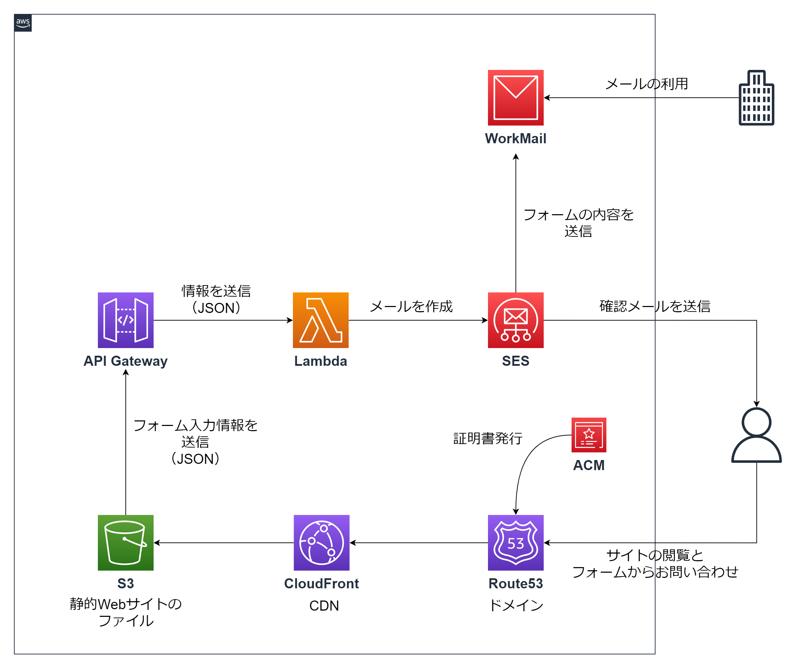

# 企業ホームページ
お得意先の企業様のホームページのサーバーの構築とお問い合わせフォームの作成をすべてAWSを使って行いました。 
## 構成図
 
`S3` `CloudFront` `Rotue53` `ACM`を使ったWebサイトの公開と、
`API Gataway` `Lambda` `SES`を使ったお問い合わせフォームの作成、
`WorkMail`を使ったメールサーバーの構築を行った構成です。 

