# AWSの運用構成

## **全体図**
 
運用において使用しているAWSサービスの全体図です。
分かりづらいかと思うので、詳細な構成図とともに細かく分けて説明します。 
また、実際は監視されるアカウント（複数）と監視アカウントで分かれています。

## **OSS**
運用と監視において使用しているOSS(オープンソースソフトウェア)は以下の通りです。  

|||||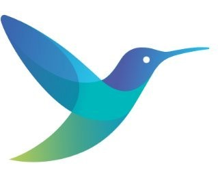|||
|---|---|---|---|---|---|---|
|**Prometheus**|**Cortex**|**Grafana**|**OpenSearch**|**FluentBit**|**OpenTelemetry**|**Ansible**|

## **AWSマネージドサービスの利用** ##
よく使われているOSSで監視の構築をすると、このような構成になりますが、 
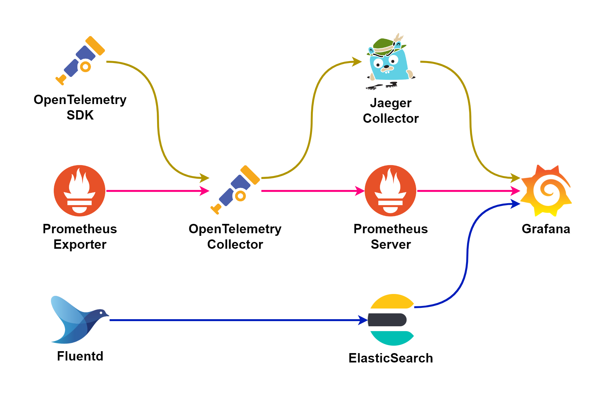 

AWSのマネージドサービスを利用する事で、出来るだけ運用や管理が楽になるようにしています。 
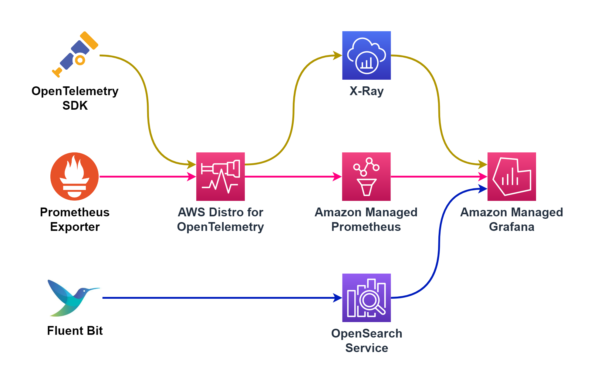 

### Grafanaによる可視化と一元化
監視項目によってツールやサービスが分かれていると面倒なので`Grafana`のダッシュボードで出来るだけすべてを監視できるようにしました。 

 
`Prometheus`・`CloudWatch`・`Zabbix`からメトリクス、 
`OpenSearch`からログ(＋セキュリティ関連のログ)、 
`X-Ray`からトレース、 
`Athena`からコストデータとサーバー情報を可視化しています。  
本番アカウントと監視アカウントを分けると以下のようになります。 
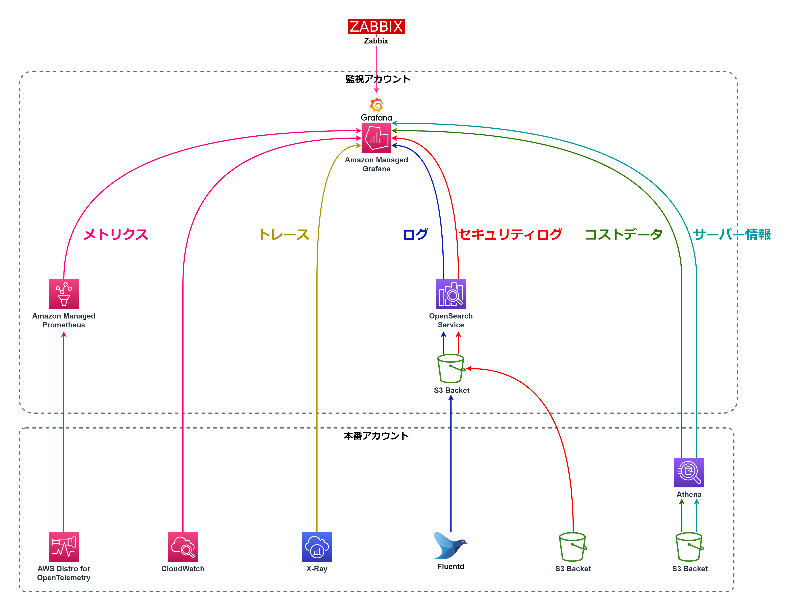 
オンプレで使用している`Zabbix`に関しても、バージョンが古く扱いづらいため、`Grafana`で可視化できるようにしていますが、Amazonの`Grafana`ではなく、オンプレにて別途`Grafana`を構築して使用します。 

## **サーバー監視**
サーバーの監視においてはobservabilityの3本の柱である、メトリクス・ログ・トレースの3つの監視を行っています。 
- メトリクスはPrometheus Exporterから取得したものを`OpenTelemetry`で`Prometheus`に送信し、`Grafana`で可視化してます。 
- ログは`Fluent Bit`からAWSのサービスである`Kinesis Data Firehose`に送信することで、`S3`にリアルタイムストリーミングを行います。 
`S3`から`Lambda`を利用して成形後、`OpenSearch`に送信・可視化し、`Grafana`に一元化しています。 
※ここで使用する`Lambda`は[SIEM on Amazon OpenSearch Service](https://github.com/aws-samples/siem-on-amazon-opensearch-service)を使用しています。 
- トレースは`OpenTelemetry`のSDKをアプリに導入することで、アプリから取得できるようになり、`OpenTelemetry`にて`X-Ray`用のデータに成形後、`X-Ray`に送信・可視化し、`Grafana`に一元化しています。 

### EC2の監視
 
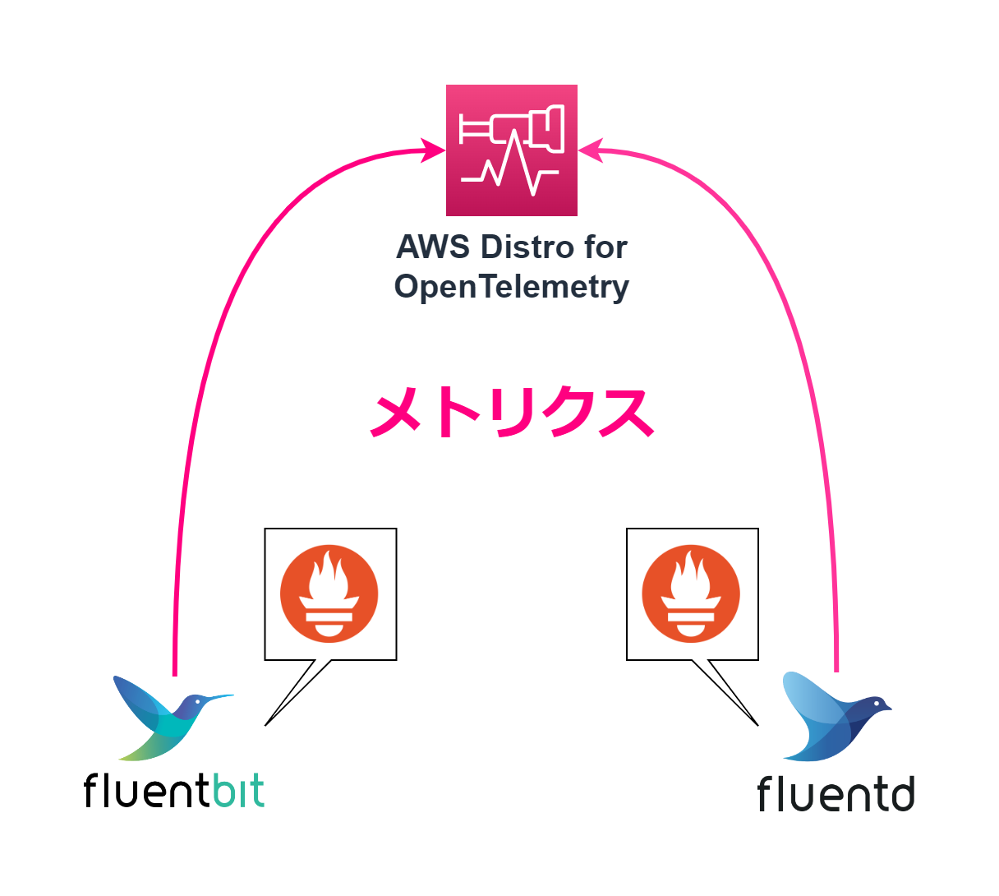  
`Fluent Bit`自体のメトリクスも`Prometheus`形式のメトリクスとして`Fluent Bit`から直接`OpenTelemetry`で収集しています。 
また`Fluent Bit`に`Node Exporter` `Windows Exporter`としての機能も搭載されているので、LinuxやWindowsのメトリクスも収集します。 

### ECSの監視
 
`ECS`では、`OpenTelemetry`がECSのエージェントからコンテナのメトリクスを取得します。 
`ECS`にてログドライバーの`FireLens`を使用しています。 

### EC2・ECS以外のAWSサービスの監視
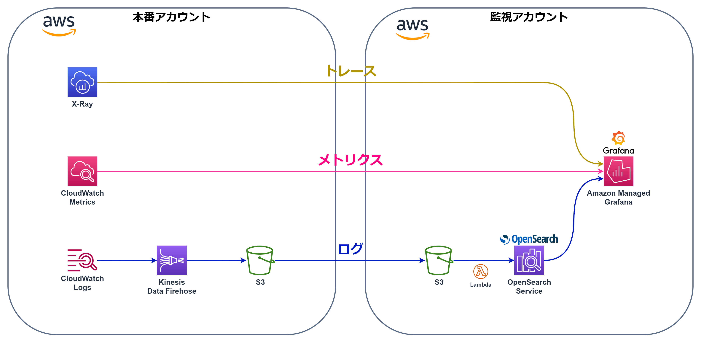 
`CloudWatch`のメトリクスは監視アカウントの`Grafana`で監視してます。 
`CloudWatch`のログは`S3`と`OpenSearch`を経由して`Grafana`で監視してます。 
`Lambda`等のトレースも`X-Ray`で取得し、`CloudWatch`同様、監視アカウントの`Grafana`で監視します。 

## **データベース**
データベースは`PostgreSQL`と`MongoDB`を使用しています。  

|||
|---|---|
**PostgreSQL**|**MongoDB**|

## **セキュリティ**
セキュリティに関しても可視化して監視しています。  
 

### セキュリティログの可視化
 
セキュリティログは`OpenSearch`に集約・可視化、`Grafana`に一元化しています。 

## **ネットワーク**

ドメインのネームサーバーをさくらインターネットから`Route53`に移管しました。  
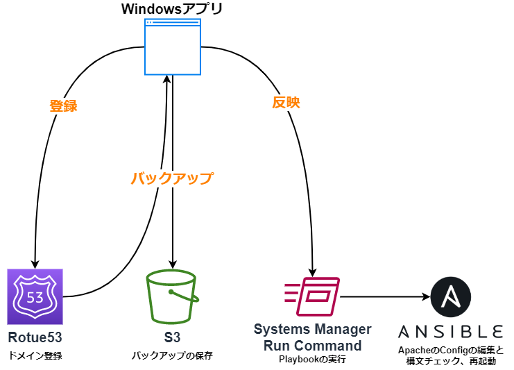 
また、サブドメインの登録業務が多いため、ドメイン登録からレコードのバックアップ、ApacheのConfファイルの編集までを実行できるWindowsアプリを作成しました。
バックアップに関しては、AWSでは用意されていないので、こちらのアプリを使用しないと実行できません。 

### ネットワークの可視化
ネットワークサービスのメトリクスとログも可視化してます。 
 
ネットワークに関するメトリクスは`CloudWatch`で可視化し、`Grafana`に一元化、 
ネットワークに関するログは`OpenSearch`に集約・可視化、`Grafana`に一元化しています。 

## **コスト管理**

 
`Budgets`と`Cost & Usage Report`のデータは`Grafana`で可視化しています。 

## **アカウント管理**
`IAM Identity Center`でログイン管理を行っています。 
 

## **運用の自動化**
AWSの運用は`Lambda` `EventBridge` `SNS` `SystemsManager`等使って出来るだけ自動化させてます。 

`EventBridge`や`SNS`をトリガーにしてLambda関数を実行しています。 
 

様々なサービスから`SNS`にアラートを送信してます。 
 

`EventBridge`を利用して、`Lambda`や`SystemsManager`のAutomation、Run Commandの実行、`SNS`を利用してのメール通知を行っています。 
 

CloudWatchアラームをトリガーにインスタンスを自動でスケーリングしてます。 
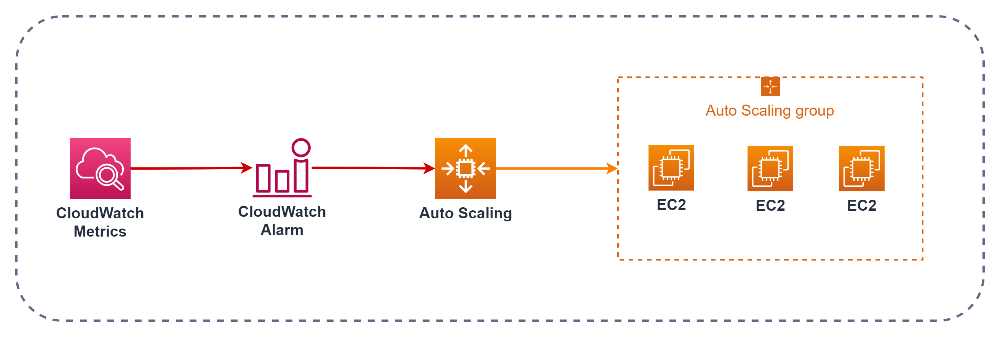 

`Backup`を利用して様々なAWSサービスのバックアップのスケジュール管理やバックアップの保持期間の管理、バックアップに対するアクセスポリシーの設定を一元管理しています。 
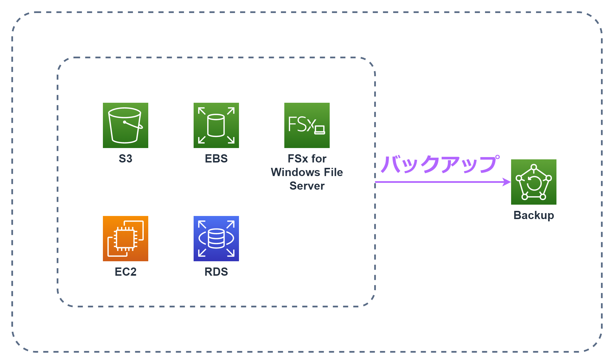 

`DevOps Guru`の機械学習を利用して`CloudWatch` `Config` `CLoudFormation` `X-Ray` `Systems Manager OpsCenter`の異常を検知しています。 
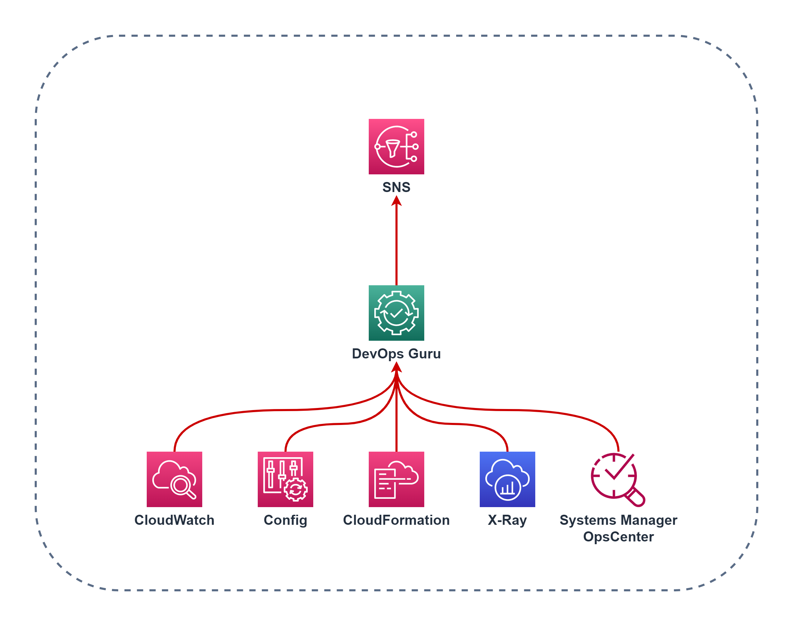 

誰かがルールに反した操作を行った際は、`EventBridge`か`Config`で検知し、`Systems Manager Automation`を利用して自動修復をするようにしています。 
  
`Systems Manager Inventory`で取得できるサーバーのインベントリも`Glue`と`Athena`を利用して、`Grafana`で可視化をしてます。 
  
`Grafana`だけでなく、Systems Manager ExplorerでAWSにおける様々な情報を一元化したダッシュボードを利用しています。 
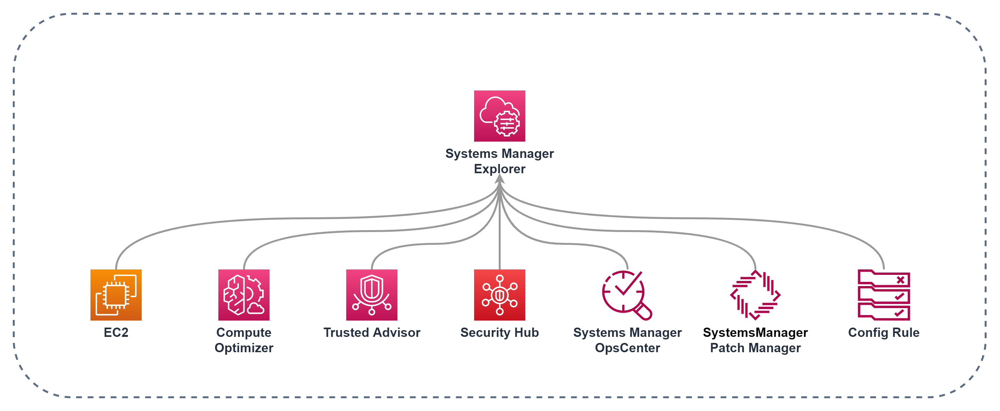  

## **構築**
AWS内のリソースは基本的に`CloudFormation(CFn)`で構築し、`CodeCommit`でバージョン管理しています。 
`CloudFormation(CFn)`を利用することで、AWSリソースをコードで管理できるので、現状を把握しやすくなりますし、 
`CodeCommit`を利用することで、変更差分がわかりやすく残るので、作業履歴として利用できます。 
さらに、`CodeBuild`と`CodePipline`を利用して、コミットから構築までを自動化させています。  

 

`Lambda`の構築・デプロイには`SAM(Serverless Application Model)`を利用しています。 

||
|---|
|**SAM**|

