# AWSの運用構成

## 全体図

運用において使用するAWSサービスの全体図です。複雑で分かりづらいと思うので分けて説明します。 
AWSの基本的なサービスについても説明します。 
## 監視ツール
監視において使用するOSS(オープンソースソフトウェア)とAWSサービスについて説明します。  

　　  
`Prometheus`はオープンソースのモニタリングツールで、CNCF(Cloud Native Computing Foundation)のgraduatedプロジェクトです。 
>CNCFとはクラウドネイティブコンピューティング技術を推進する非営利団体で、CNCFのGraduatedプロジェクトはCNCFにより「成熟した」と認められたプロジェクトのことです。有名な例だとKubernetesが挙げられます。 

Prometheus Exporterからデータを収集し、PromQLという専用クエリ言語でメトリクスデータを柔軟に表示できます。 
`Grafana`が`Prometheus`の可視化ツールとしてよく利用されています。 
デメリットとしてはストレージ設計や構築、運用管理にコストがかかったり、障害時の調査や復旧が難しい等があげられますが、AWSのマネージドサービスである`Amazon Managed Service for Prometheus(AMP)`を利用することでデメリットを解決できます。  
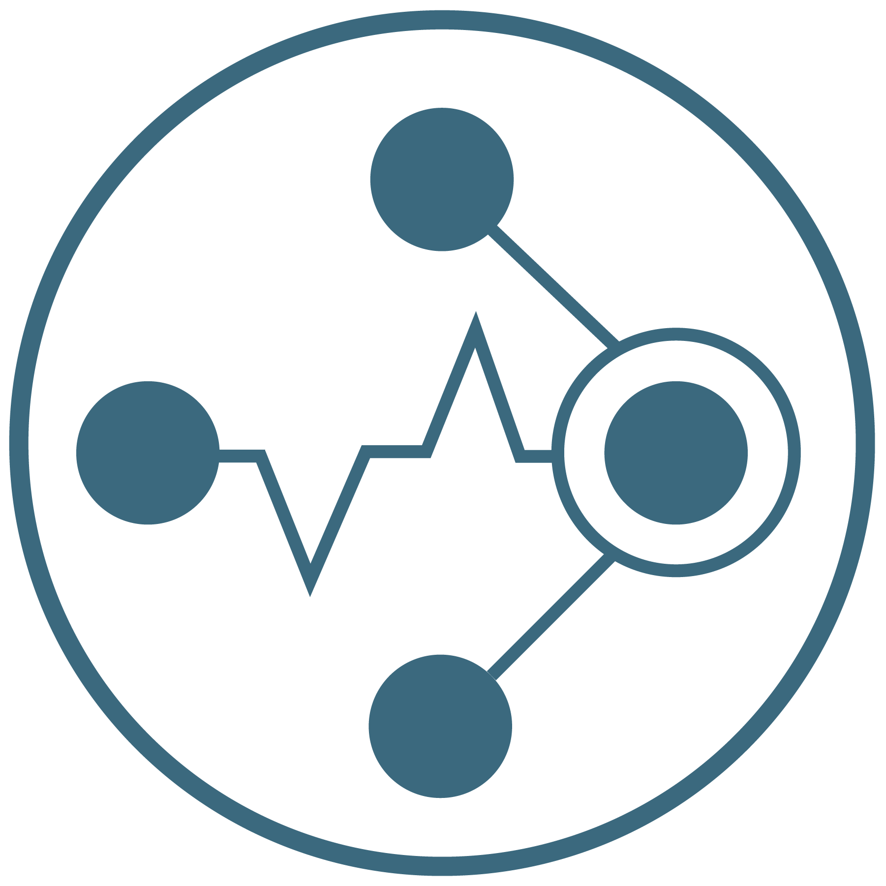 
※`AMP`ではストレージにCNCFのIncubatingプロジェクトである`Cortex`が使用されていますが、`AMP`を使用する上ではストレージを意識する必要がないので、`Cortex`に関しても特に意識する必要はありません。 

　　  
`Grafana`はオープンソースのデータ可視化ツールで、可視化に特化しているため、他プロダクトが独自で用意しているダッシュボードよりも時系列グラフの可視化自由度が高いです。 
また、データソースとしてさまざまなデータを可視化できます。 
デメリットとしてはストレージ設計や構築、運用管理にコストがかかる等があげられますが、
AWSのマネージドサービスである`Amazon Managed Grafana(AMG)`を利用することでデメリットを解決できます。 

　　  
`OpenSearch`は`ElasticSearch`と`Kibana`から派生したオープンソースのツールで、AWSによって開発されました。 
様々な形式のデータの収集・可視化が可能です。 
AWSのマネージメントサービスである`Amazon OpenSearch Service`を使用します。 
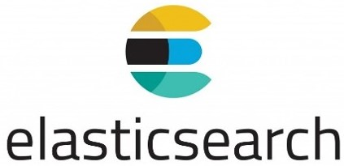　　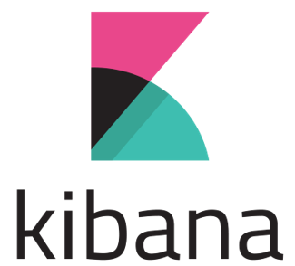 
※`ElasticSearch`はElastic社によって開発されたオープンソースの全文検索エンジンでログの収集によく利用されています。 
また、`Kibana`はElastic社によって開発された`ElasticSearch`の可視化ツールです。  

 
**CloudWatch** 
AWSサービスのメトリクスとログを収集・可視化するAWSのサービスです。

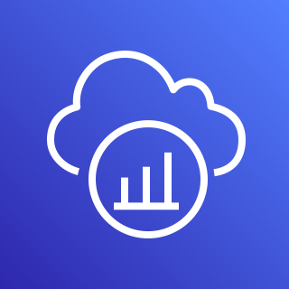 
**X-Ray** 
トレースを収集・可視化するAWSのサービスです。 

 
**Athena** 
S3内のデータをSQLを利用して分析できるAWSのサービスです。`Glue`というサービスでS3のデータのテーブルを作成し`Athena`にてSQLでの分析が出来るようにします。
## Grafanaによる可視化と一元化
監視項目によってツールやサービスが分かれていると面倒なので`Grafana`のダッシュボードで出来るだけすべてを監視できるようにしています。 
ただ`Grafana`ですべてが監視出来るわけではないので、詳細を知りたい際には各々のツールやサービスを確認することになると思います。 
ダッシュボードが確認できるツール・サービスについては全体図にてダッシュボードマークをつけています。 
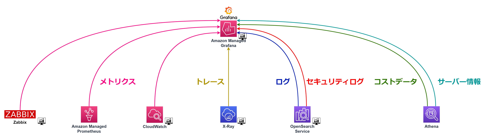
`Prometheus`・`CloudWatch`・`Zabbix`からメトリクス、 
`OpenSearch`からログ(＋セキュリティ関連のログ)、 
`X-Ray`からトレース、 
`Athena`からコストデータとサーバー情報を可視化します。 

## サーバー
サーバーとサーバーにインストールするツールについて説明します。 
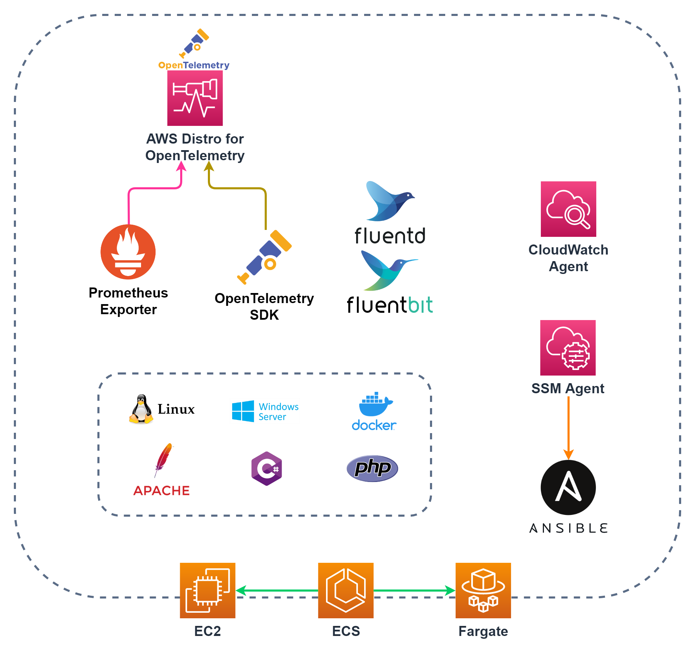 

### **仮想サーバー**
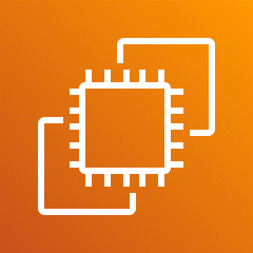 
**EC2** 
LinuxやWindowsなどの仮想サーバを作成できるサービスです。 
 
**ECS** 
コンテナ化されたアプリケーションを簡単にデプロイ、管理、およびスケーリングできるサービスです。 
起動するサーバーのタイプには`EC2`と`Fargate`があり、どちらも使用しています。 
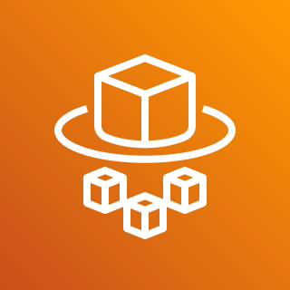 
**Fargate** 
`Fargate`を利用するとコンテナをサーバーレスで実行することができます。そのためインスタンスの管理が不要になります。 

### **ツール**  
 
`Fluentd`はアプリケーションなどからログデータを収集し、フィルタリングして複数の宛先に送信できるオープンソースのツールで、CNCFのgraduatedプロジェクトです。 
出力先として様々なサービスが用意されており、数百のプラグインが利用可能です。 

 
`FluentBit`は`Fluentd`の軽量版。 
ECSではこちらを使用します。 

　　  
`OpenTelemetry`はクラウドネイティブアプリケーションとインフラストラクチャから「メトリクス」「トレース」のキャプチャと成形、エクスポートをするオープンソースのツールで、CNCFのIncubatingプロジェクトです。 
`AWS Disto for OpenTelemetry(ADOT)`というAWSサポートのディストリビューションがあり、エクスポート先にAWSのサービスがサポートされています。 

 
**Prometheus Exporter** 
`Prometheus`用のメトリクスを収集するツールです。 
様々な種類のExporterが用意されており、以下がその例です。 

|||
|---|---|
|node_exporter|Linuxサーバの基本情報(topコマンド的な情報)を送信。|
|windows_exporter|Windowsサーバの基本情報(タスクマネージャー的な情報)を送信。|
|apache_exporter|Apacheの情報を送信。|
|blackbox_exporter|HTTPやTCPなどを介したエンドポイント情報を送信。Webサービスの死活監視に利用。|
|ssl_exporter|Webサーバに使用しているSSL証明書の情報を送信。SSL証明書の期限監視に便利。|

 
**CloudWatch Agent** 
`CloudWatch`用のメトリクス、ログを収集するエージェントです。 
基本的には`Prometheus`でメトリクスを収集しますが、`Auto Scaling`や`Compute Optimizer`では`CloudWatch`のメトリクスを利用するため、`CloudWatch`でも一部メトリクスを収集することになります。 

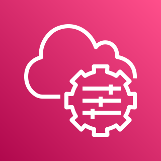 
**SSM Agent** 
`Systems Manager`用のエージェントです。 
インストールすることで、サーバーに対して`Systems Manager`の様々な機能が利用できます。 

 
`Ansible`は多数のサーバーや複数のクラウドインフラを統一的に制御できるオープンソースの構成管理ツールです。 
「Playbook」というファイルを利用して、サーバーに接続することなく、インストールや設定ファイルの更新等実行できます。 
`Systems Manager`のRun Commandという機能で「Playbook」が利用でき、ネット上で様々な「Playbook」を参照できるので活用しやすいです。 
ドメイン登録の際のApacheの設定ファイルの編集などで利用します。 

## サーバー監視
サーバーの監視においてはメトリクス・ログ・トレースの3つの監視が重要になります。 
- メトリクスはPrometheus　Exporterから取得したものを`OpenTelemetry`で`Prometheus`に送信し、`Grafana`で可視化します、 
- ログは`Fluentd`からAWSのサービスである`Kinesis Data Firehose`に送信することで、`S3`にリアルタイムストリーミングを行います。 
`S3`から`Lambda`を利用して成形後、`OpenSearch`に送信・可視化し、`Grafana`に一元化します。 
※ここで使用する`Lambda`は[SIEM on Amazon OpenSearch Service](https://github.com/aws-samples/siem-on-amazon-opensearch-service)を使用しています。 
- トレースは`OpenTelemetry`のSDKをアプリに導入することで、アプリから取得できるようになり、`OpenTelemetry`にて`X-Ray`用のデータに成形後、`X-Ray`に送信・可視化し、`Grafana`に一元化します。 
### EC2の監視
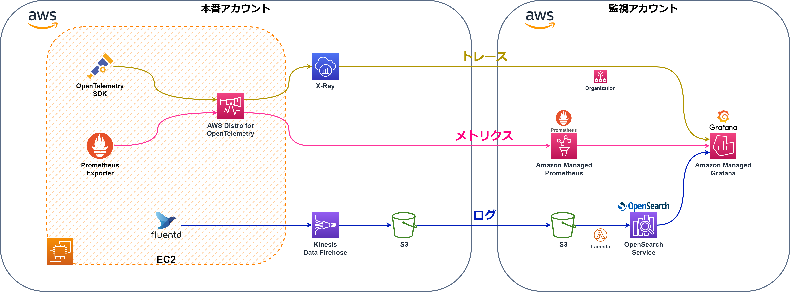 
### ECSの監視
 
ECSでは、`OpenTelemetry`がECSのエージェントからコンテナのメトリクスを取得します。 
また、ECSにおいては`Fluentd`よりも`FluentBit`の利用が推奨されているため、`FluentBit`を使用します。 
ECSにて用意されている`FireLens`というログドライバーを使用することで、自動で`FluentBit`のサイドカーコンテナが用意されます。
## セキュリティ
セキュリティに関しては以下のようにAWS内で様々なサービスが用意されています。 
これらも可視化して監視できるようにしています。  
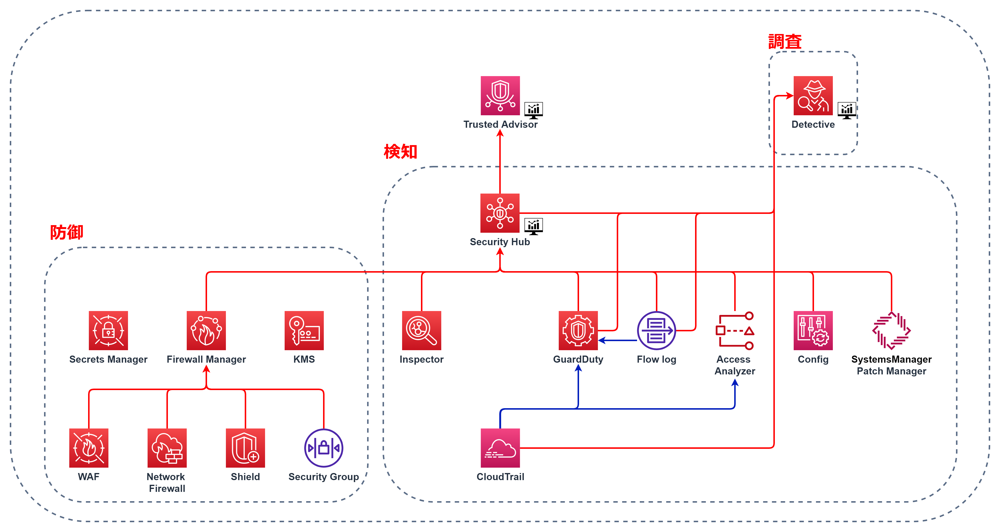 

### **保護** 
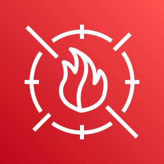 
**WAF** 
Webアプリケーションファイアウォールです。 
ベンダー提供のマネージドルールとユーザー定義ルールを組み合わせて、保護の条件を指定します。 

 
**Shield** 
DDoS攻撃から保護します。 
Standardは無料でAdvancedは有料。Advancedはより強力に攻撃から保護することができます 

 
**Network Firewall** 
VPC向けのファイアーウォールです。 
`Network ACL`や`Security Group`に比べてより高度なファイアウォールを実装できます。 

 
**Network ACL** 
サブネット単位のファイアウォールです。 

**Security Group** 
インスタンス単位のファイアウォールです。 

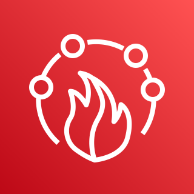 
**Firewall Manager** 
`WAF` `Shield` `Network Firewall` `Network ACL` `Security Group`を一元化します。 

 
**KMS** 
暗号化操作に使用されるキーを簡単に作成および管理します。 

### **検知** 
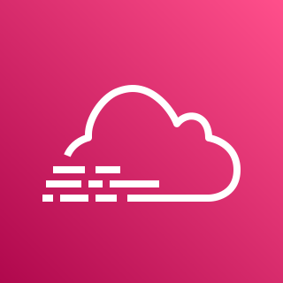 
**CloudTrail** 
AWSAccountに対する操作のイベントログを記録するサービスです。 
取得できる操作記録は「管理イベント」「データイベント」「インサイトイベント」の3種類です。 

 
**Config** 
AWSリソースやEC2インスタンス、オンプレミスサーバーの設定の変更管理、変更履歴のモニタリングを行うためのサービスです。 
また、設定に対するルールを指定でき、ルール違反した場合に`Systems Manager`のAutomationを実行させて、自動修復させることが出来ます。 

 
**VPC Flow Log** 
VPC内のIPトラフィック状況をログとして保存できるVPCの機能です。 

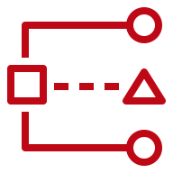 
**IAM Access Analyzer** 
リソースのポリシーを確認して、意図せぬ公開設定などがされていないか検出し、可視化する機能です。 

 
**GuardDuty** 
`CloudTrail`や`VPC Flow Log`からAWS上で発生する不正やセキュリティイベントなどの脅威を検出するサービスです。 

 
**Inspector** 
SSMエージェントを導入したサーバーの脆弱性を検知するサービスです。 

 
**Macie** 
S3バケット上にある個人情報等の機密データを自動的に発見し、通知や保護処理を実行するサービスです。 

 
**Security Hub** 
`GuardDuty` `Inspector` `Detective` `Macie` `IAM Access Analyzer` `Config`の検知内容を集約します。 
また、べストプラクティスや業界標準に基づいた、継続的なAWS環境の自動チェックも行います。 

 
**Trusted Adviser** 
AWSのベストプラクティスの情報に基づいて、今設定されているものを自動的にをチェックし、推奨事項をレコメンドしてくれます。 

### **調査** 
 
**Detective** 
`VPC Flow Log` `GuardDuty` `CloudTrail`から、
潜在的なセキュリティ問題や不審なアクティビティを分析、調査 

### 可視化
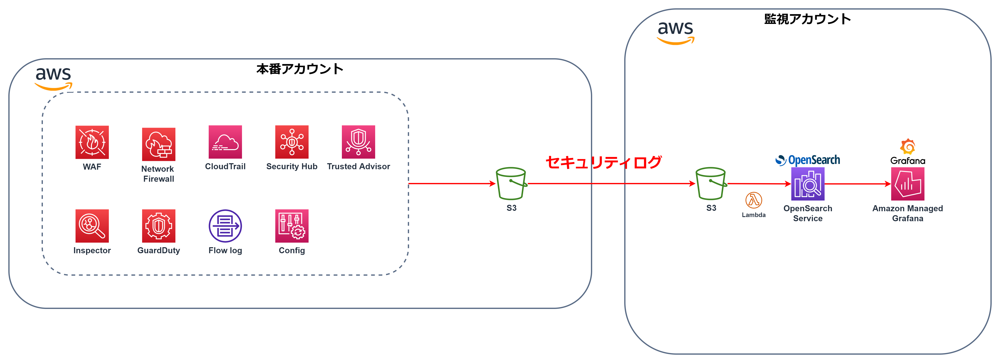 
セキュリティログは`OpenSearch`に集約・可視化、`Grafana`に一元化します。 

## ネットワーク
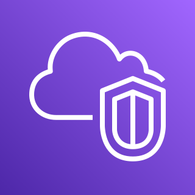 
**VPC** 
AWS上に作成できるプライベート仮想ネットワーク空間です 

 
**DirectConnect** 
AWS への専用ネットワーク接続です。さくらインターネットと接続しています。 
 
社内サーバーとはVPN接続で接続しています。 

 
**Route53** 
AWSのDNSサービスです。ドメインのネームサーバーはこちらに移管済みです。 

 
**CloudFront** 
コンテンツ配信ネットワーク (CDN) サービスです。 

 
**ELB** 
ロードバランシングを行うサービスです。  

### 可視化
これらサービスのメトリクスとログも可視化します。 
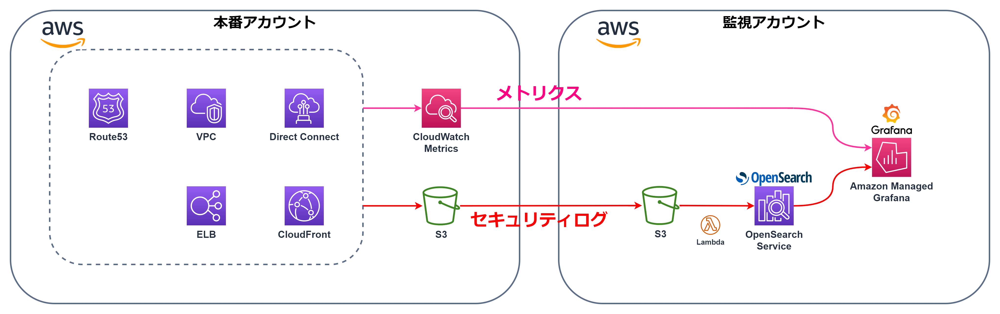 
ネットワークに関するメトリクスは`CloudWatch`で可視化し、`Grafana`に一元化、 
ネットワークに関するログは`OpenSearch`に集約・可視化、`Grafana`に一元化します。 

## コスト管理
以下のサービスを利用して、コストの監視と最適化を行います 

 
**Cost Explorer** 
AWSコストや使用料を可視化するダッシュボードサービスです。 
AWSアカウントをまたいだ分析やコスト算出もできます。 

 
**Budgets** 
AWSの使用料や予算額を管理するサービスです。 
予算をオーバーした際のメール通知が可能です。 

 
**Cost and Usage Report** 
AWSのコストやリソースの使用状況を`S3`にアップロードします。 
`Glue`と`Athena`を使ってETL処理を行い、`Grafana`で可視化します。 

 
**Compute Optimizer** 
`EC2`のCPU使用率などの利用状況を機械学習し、最適なインスタンスタイプを推奨してくれます。  

### 可視化
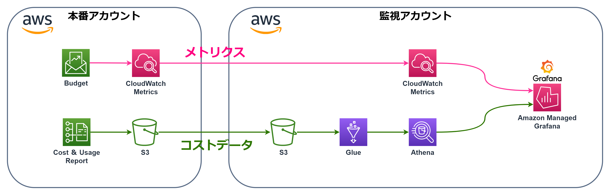 
`Budgets`と`Cost & Usage Report`のデータは`Grafana`で可視化します。 
## アカウント管理
`IAM Identity Center`と呼ばれるSingle Sign On（SSO）のサービスでログイン管理を行います。 
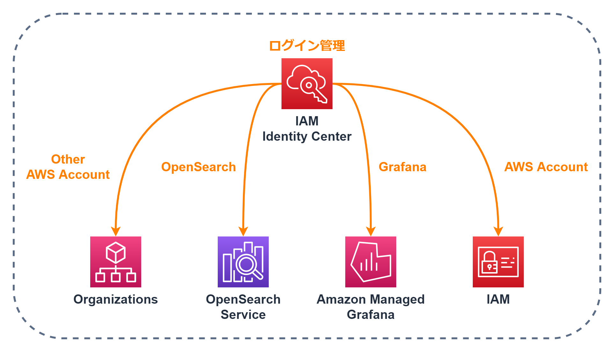 
`IAM Identity Center`では複数のAWSアカウントと、`OpenSearch`、`Grafana`のログインを一元管理出来ます。 

## 運用の自動化
以下のサービスを利用して、運用を出来るだけ自動化させます。 
これらサービスのメトリクスも`CloudWatch`で取得できるので、自動化が失敗していないかどうか等の監視も行えます。 

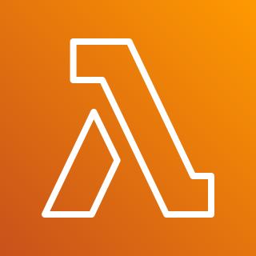 
**Lambda** 
コードをサーバーなしで実行できるサービスで、運用においても様々なLambda関数を利用します。 
言語はPythonかNode.jsが主流なので、現段階ではこれらの言語を使用しています。  
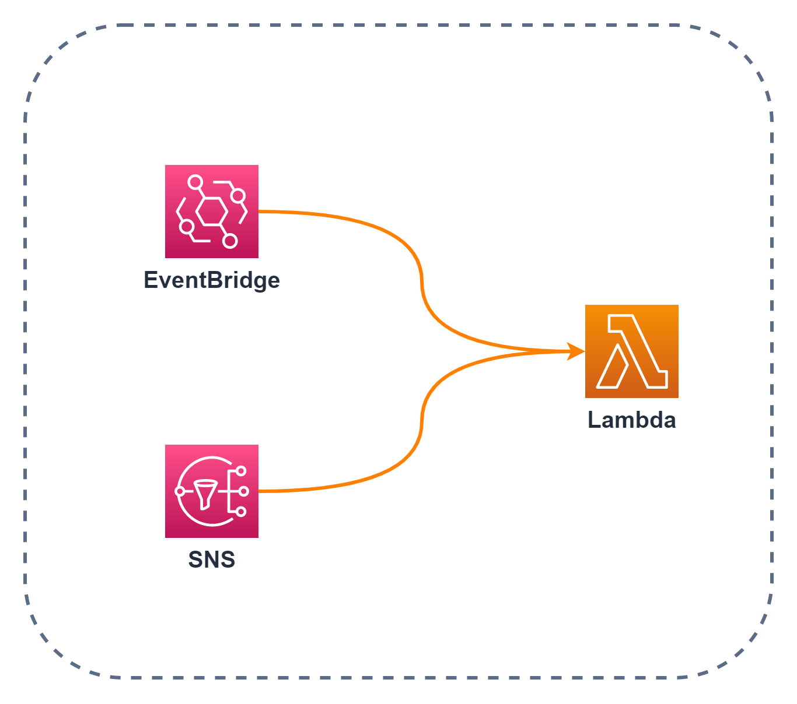 
`EventBridge`や`SNS`をトリガーにして関数を実行できます。他にも様々なサービスをトリガーに出来ます。 

 
**SNS** 
メールの送信だけでなく、`Lambda`の実行も行えるため、アラートに対しての自動対応が可能です。  
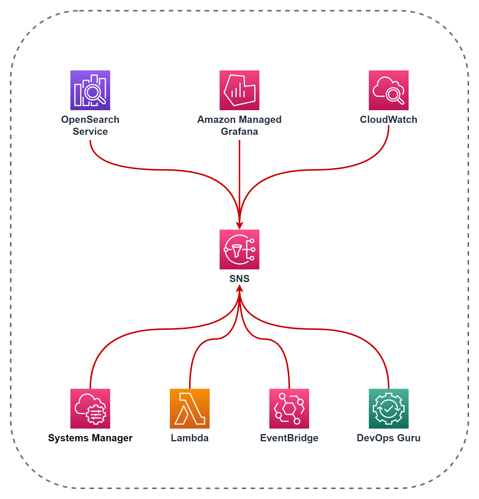 
様々なサービスから`SNS`にアラートを送信できます。

 
**EventBridge** 
AWSのイベントやスケジュールを検知し、`Lambda`の実行や`SNS`を利用してのメール通知を行います。 
`Lambda`や`SystemsManager`のAutomationが実行出来るため、AWSでのイベントをトリガーにした自動処理を行えます。 

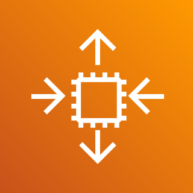 
**Auto Scaling** 
CloudWatchアラームをトリガーにインスタンスを自動でスケーリングします。 

 
**Backup** 
AWSサービスのバックアップのスケジュール管理やバックアップの保持期間の管理、バックアップに対するアクセスポリシーの設定を一元管理できます。 

 
**DevOps Guru** 
機械学習を使用して異常な動作パターンを検出するサービスです。

 
**System Manager(SSM)** 
複数のサーバーに一括でコマンドを実行、複数の処理を一括実行、
サーバー上で稼働するソフトウェアの一覧を表示したりと、運用に関する複数の機能が利用できます。 
SSM Agentをサーバーに導入することで利用できます。オンプレのサーバーにも利用可能です。  
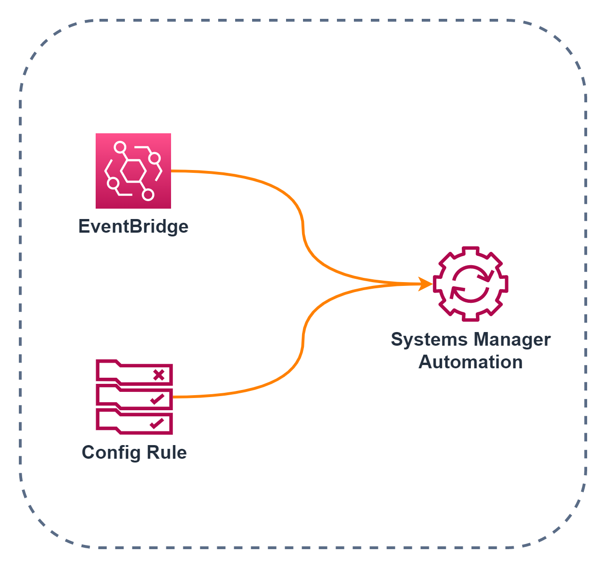 
`EventBridge`や`Config`をトリガーに`Systems Manager`のAutomationが実行できます。 
Configルールに違反していた際に、自動修復するなどの使い方ができます。  
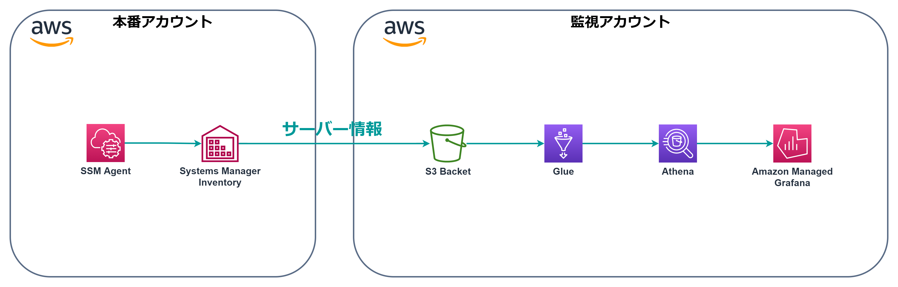 
`Systems Manager`で取得できるサーバーのインベントリも`Glue`と`Athena`を利用して、`Grafana`で可視化ができます。 
## 構築
AWS内のリソースは基本的に`CloudFormation(CFn)`で構築し、`CodeCommit`でバージョン管理します。 
`CloudFormation(CFn)`を利用することで、AWSリソースをコードで管理できるので、現状を把握しやすくなりますし、 
`CodeCommit`を利用することで、変更差分がわかりやすく残るので、作業履歴として利用できます。 
さらに、`CodeBuild`と`CodePipline`を利用して、コミットから構築までを自動化させます。 
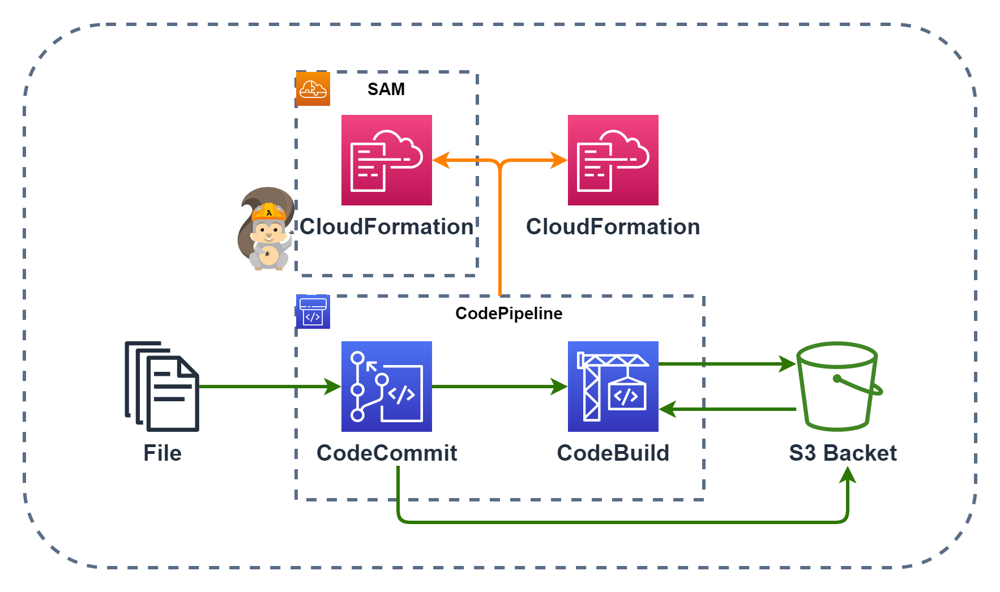 

`CloudFormation(CFn)`のテンプレートを`CodeCommit`にコミットすると、
`CodePipline`により`CodeBuild`でテストされ、`CloudFormation`が実行されます。  
 
同様に`Lambda`のコードを`CodeCommit`にコミットすると、`CodePipline`により`CodeBuild`でテストされ、`Serverless Application Model(SAM)`によって`CloudFormation`が実行され、作成された`Lambda`にコードのデプロイも行います。