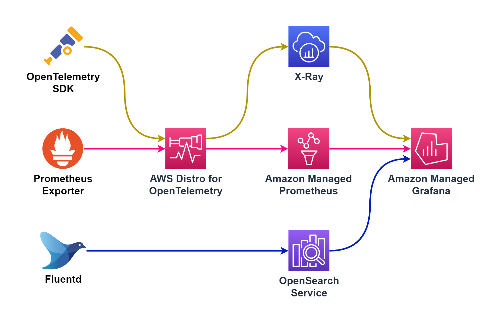
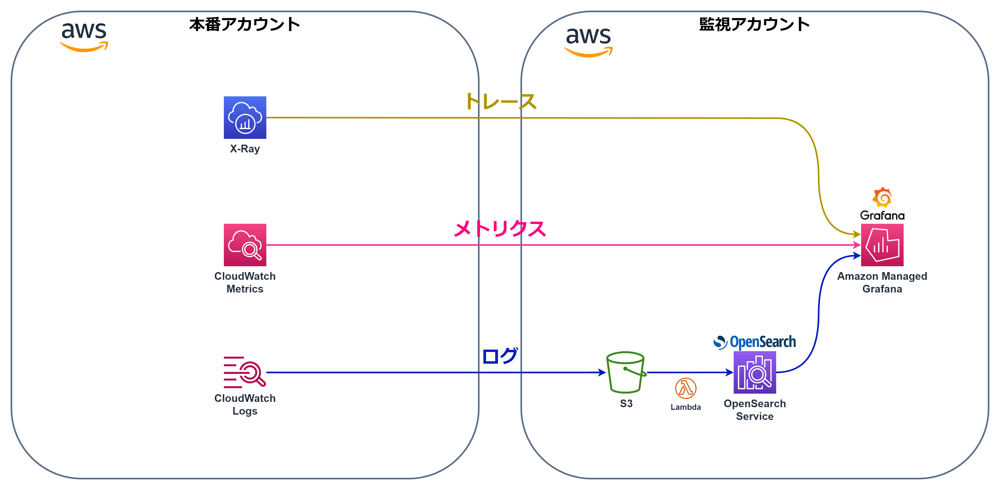
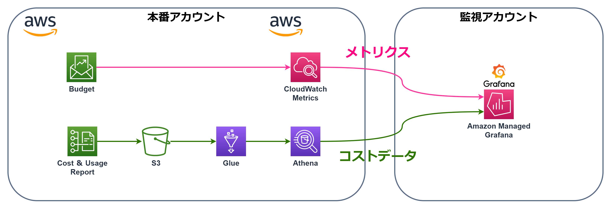
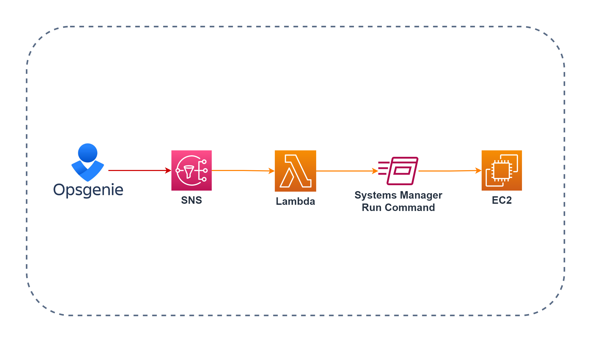
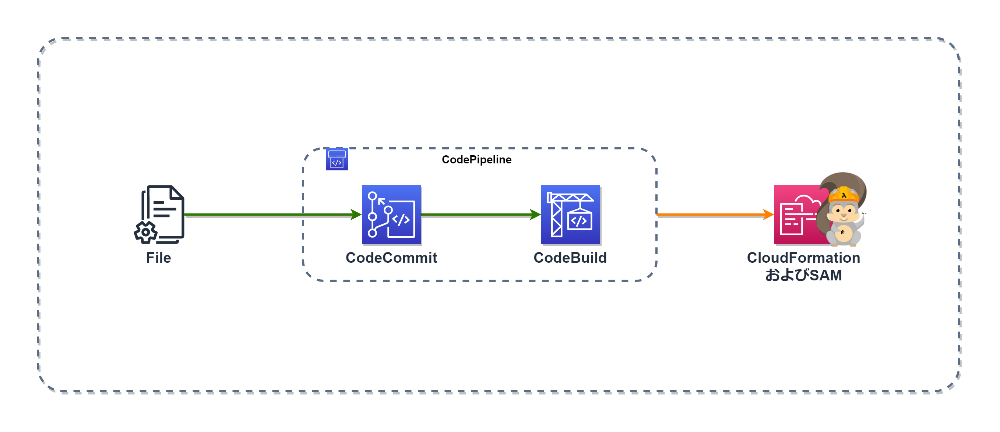

# **AWSの運用構成**

## **全体図**
下画像は運用において使用しているAWSサービスの全体図です。
運用におけるすべての流れを図示したために複雑になってしまったので、細かく分けて説明します。 
また、実際は監視されるアカウント（複数）と監視アカウントで分かれています。[別の案件](HP案件/README.md)で使用しているAWSアカウントの監視も行っています。 
構築手順は[こちら](手順/README.md)に、作成したツールは[こちら](Tool/README.md)に記載しました。 

 

## **OSS**
運用と監視において使用しているOSS(オープンソースソフトウェア)は以下の通りです。  

|||||||||
|---|---|---|---|---|---|---|---|
|**[Prometheus](https://prometheus.io/docs/introduction/overview/)**|**[Cortex](https://cortexmetrics.io/docs/)**|**[Grafana](https://grafana.com/docs/grafana/latest/)**|**[OpenSearch](https://opensearch.org/docs/latest/)**|**[FluentBit](https://docs.fluentbit.io/manual/)**|**[Fluentd](https://docs.fluentd.org/)**|**[OpenTelemetry](https://aws-otel.github.io/)**|**[Ansible](https://docs.ansible.com/)**|

## **AWSマネージドサービスの利用** ##
よく使われているOSSで監視の構築をすると、このような構成になりますが、 
 

AWSのマネージドサービスを利用する事で、出来るだけ運用や管理が楽になるようにしています。 
 

### Grafanaによる可視化と一元化
監視項目によってツールやサービスが分かれているため、`Grafana`のダッシュボードだけですべてを監視できるようにしました。 

 
`Prometheus`・`CloudWatch`・`Zabbix`からメトリクス、 
`OpenSearch`からログ、 
`X-Ray`からトレース、 
`Athena`からコストデータとサーバー情報を可視化しています。  
AWSの本番アカウントと監視アカウント、AWS外を分けると以下のようになります。 
 
一部AWSに移行しないサーバーがあるため、そちらの監視には元々監視で使用していた`Zabbix`を引き続き利用します。監視ツールが分かれていると面倒なため、`Zabbix`の内容も`Grafana`で確認できるようにしました。。 

## **サーバー監視**
サーバーの監視においてはobservabilityの3本の柱である、メトリクス・ログ・トレースの3つの監視を行っています。 
- メトリクスはPrometheus Exporterから取得したものを`OpenTelemetry`に集約し、`Prometheus`に送信。`Grafana`で可視化してます。`Prometheus`でのストレージ費用を節約するため、`OpenTelemetry`はメトリクスのフィルタリングも行っています。 
 `OpenTelemetry`は通常監視されるサーバーに導入するものだと思われますが、サーバー毎にフィルタリングするのが大変なのと、設定変更の際にサーバーにログインしなくても済むように、別途サーバーを用意して、メトリクスを集約しています。  

- ログは`Fluent Bit`から`Fluentd`に集約し、バッファリングして`S3`に送信。 
`S3`から`Lambda`を利用して成形後、`OpenSearch`に送信し、`Grafana`にて可視化しています。 
※ここで使用する`Lambda`は[SIEM on Amazon OpenSearch Service](https://github.com/aws-samples/siem-on-amazon-opensearch-service)にて用意しました。  

- トレースは`OpenTelemetry`のSDKをアプリに導入することで、アプリから取得できるようになり、`OpenTelemetry`にて`X-Ray`用のデータに成形後、`X-Ray`に送信、`Grafana`にて確認できるようにしています。 

### **SIEM on Amazon OpenSearch Serviceとは** ###
>SIEM は Security Information and Event Management の略で、セキュリティ機器、ネットワーク機器、その他のあらゆる機器のデータを収集及び一元管理をして、相関分析によって脅威検出とインシデントレスポンスをサポートするためのソリューションです。OpenSearch Service は、オープンソースの OpenSearch と OpenDashboards を大規模かつ簡単でコスト効率の良い方法を使用してデプロイ、保護、実行する完全マネージド型サービスです。OpenSearch Service の環境に SIEM として必要な機能を実装したのが SIEM on Amazon OpenSearch Service  です。

 

※[SIEM on Amazon OpenSearch Service Workshop](https://catalog.us-east-1.prod.workshops.aws/workshops/60a6ee4e-e32d-42f5-bd9b-4a2f7c135a72/ja-JP/01-introduction)より引用。

### EC2の監視
`OpenTelemetry`と`Fluentd`は集約用のサーバーを別途用意して利用しています。`Prometheus`のblackbox exporterを導入することで、各サーバーのヘルスチェックも行っています。 

  

`Fluent Bit`と`Fluentd`自体のメトリクスも`Prometheus`形式のメトリクスとして`Fluent Bit` `Fluentd`から直接`OpenTelemetry`で収集しています。 

  

### ECSの監視
`ECS`では、`OpenTelemetry`がECSのエージェントからコンテナのメトリクスを取得します。 
`ECS`にてログドライバーの`FireLens`を使用しています。 
`ADOT`が二つ存在していますが、片方はECSエージェントからコンテナメトリクスを取得する用で、片方はEC2の時と同じく集約用です。  
 

### EC2・ECS以外のAWSサービスの監視
`CloudWatch`のメトリクスは監視アカウントの`Grafana`で監視してます。 
`CloudWatch`のログは`S3`と`OpenSearch`を経由して`Grafana`で監視してます。 
`Lambda`等のトレースも`X-Ray`で取得し、`CloudWatch`同様、監視アカウントの`Grafana`で監視します。 

  
## **アラート**

監視する項目によって使用するサービスが分かれているため、アラートを通知するサービスもバラバラになっています。そのため、すべてのアラートを`Opsgenie`というサービスに一元化し、`Opsgenie`にてアラートの管理を行います。 
また`Opsgenie`からさらにアラートを通知することが出来、メールだけでなく、電話やチャットツールも利用できます。 

  

`CloudWatch`だけでなくAWSの様々なサービスからのアラートに対応しています。 

  

`DevOps Guru`は機械学習を利用して`CloudWatch` `Config` `CLoudFormation` `X-Ray` `Systems Manager OpsCenter`の異常を検知しています。 

  

またエラーログに対するアラートは出来るだけ早く通知したいのと、`Grafana`でのアラートが目的に合わなかったので、`Fluentd`からアラートを送信するようにしています。 
また、用意されていた`Amazon SNS`に送信するプラグインも目的に合わなかったため、プラグインのコードを一部改修しました。 
`Fluentd`でのアラート設定を行うツールも作成しました。詳細は[こちら](Tool/README.md)。 

  

## **Webサーバー**
Webサーバーには`Apache HTTP Server`を使用し、構築からチューニングまで行いました。  

||
|---|
**Apache**|

## **データベース**
データベースは`PostgreSQL`と`MongoDB`を使用しています。  

|||
|---|---|
**PostgreSQL**|**MongoDB**|

## **セキュリティ**
セキュリティにおいても様々なAWSサービスを使っており、それらのログを可視化して監視しています。 

 

### セキュリティログの可視化
セキュリティログは`OpenSearch`に集約・可視化、`Grafana`に一元化しています。 

 

## **ネットワーク**

ドメインのネームサーバーをさくらインターネットから`Route53`に移管しました。  
また、サブドメインの登録業務が多いため、ドメイン登録からレコードのバックアップ、ApacheのConfファイルの編集までを`Lambda`で自動化するツールを作成しました。詳細は[こちら](Tool/README.md)。  

### ネットワークの可視化
ネットワークサービスのメトリクスとログも可視化してます。 

 
ネットワークに関するメトリクスは`CloudWatch`で可視化し、`Grafana`に一元化、 
ネットワークに関するログは`OpenSearch`に集約・可視化、`Grafana`に一元化しています。 

## **コスト管理**

`Budgets`と`Cost & Usage Report`のデータは`Grafana`で可視化しています。 

 

## **アカウント管理**
`IAM Identity Center`でログイン管理を行っています。 

 

## **運用の自動化**
AWSの運用は`Lambda` `EventBridge` `SNS` `SystemsManager`等使って出来るだけ自動化させてます。 

`EventBridge`や`SNS`をトリガーにしてLambda関数を実行しています。 

 

`OpsGenie`から`SNS`に送信されたアラートを元に`Lambda`を起動して、`Systems Manager Run Command`を実行することで、メトリクスやログをもとにインスタンスにコマンドを自動実行するようにしています。 

 

`EventBridge`を利用して、`Lambda`や`SystemsManager`のAutomation、Run Commandの実行、`SNS`を利用してのメール通知を行っています。 

 

CloudWatchアラームをトリガーにインスタンスを自動でスケーリングしてます。 

 

`Backup`を利用して様々なAWSサービスのバックアップのスケジュール管理やバックアップの保持期間の管理、バックアップに対するアクセスポリシーの設定を一元管理しています。 

 

誰かがルールに反した操作を行った際は、`EventBridge`か`Config`で検知し、`Systems Manager Automation`を利用して自動修復をするようにしています。 

  
`Systems Manager Inventory`で取得できるサーバーのインベントリも`Glue`と`Athena`を利用して、`Grafana`で可視化をしてます。 

  

## **構築**
AWS内のリソースは基本的に`CloudFormation`で構築し、`CodeCommit`でバージョン管理しています。 
`CloudFormation`を利用することで、AWSリソースをコードで管理できるので、現状を把握しやすくなりますし、 
`CodeCommit`を利用することで、変更差分がわかりやすく残るので、作業履歴として利用できます。 
さらに、`CodeBuild`と`CodePipline`を利用して、コミットから構築までを自動化させています。  

 

`Lambda`の構築・デプロイには`SAM(Serverless Application Model)`を利用しています。 

||
|---|
|**SAM**|

`Lambda`と`AWS SDK`を利用してAWSリソースを操作するツールもいくつか作成しています。静的Webサイトを作成(アクセスは社内のみ)を作成し、`JavaScript`から`API Gateway`を利用して`Lambda`を動かしています。

 

他にも`AWS CLI`を使った構築も行っています。

 

