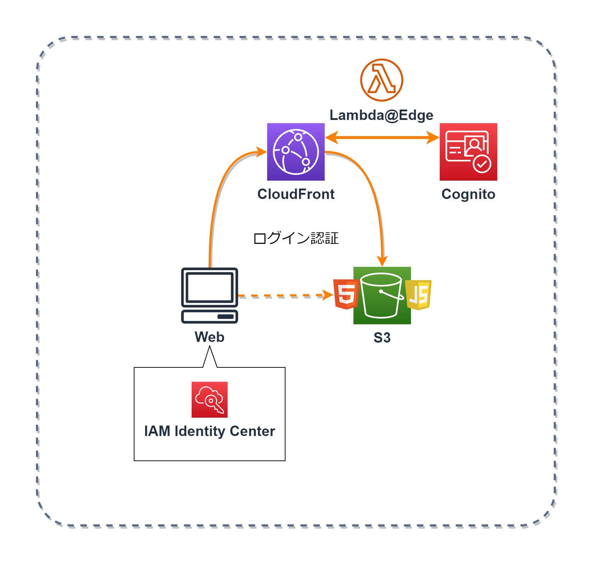
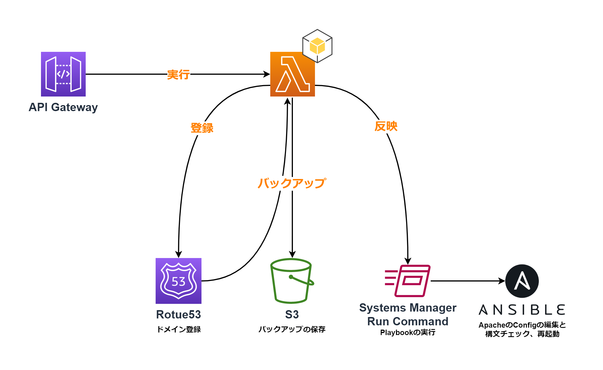
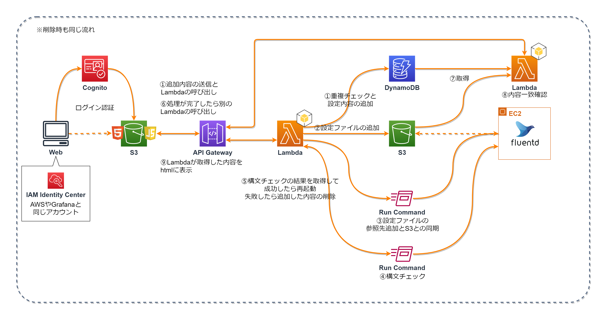

# 作成したツール
運用において使用するツールの一覧です。 
ツールのUIは`HTML`と`JavaScript`で作成し、`S3`に保存。`Cognito`を利用して、`AWS`や`Grafana`と同じアカウントでログインできるようにしています。 

  

## Apacheのサブドメイン登録ツール(Node.js)
サブドメインの登録業務が多いため、Route53にサブドメインの登録、レコードのバックアップをS3に作成、ApacheのConfファイルを編集して構文チェック、Apacheの再起動までを自動化するツールを作成しました。 

  

## Fluentdの設定登録ツール(Node.js)
`Fluetnd`にてログのアラートを複数設定をするため、それを自動化するツールを作成しました。
`DynamoDB`にバックアップを作成し、`S3`に設定ファイルを作成。`Run Command`を利用して、サーバー内部に`S3`にある設定ファイルを反映させ、構文チェックを実行。成功したら再起動し、失敗したら登録内容の削除を行います。 
また、`DynamoDB`の中身を表示することで、設定しているアラート内容を確認できるようにしています。 

  