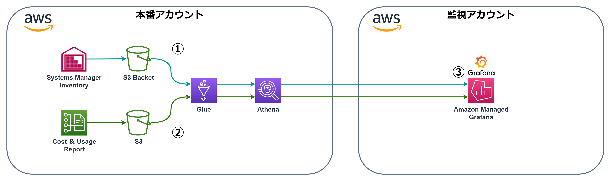
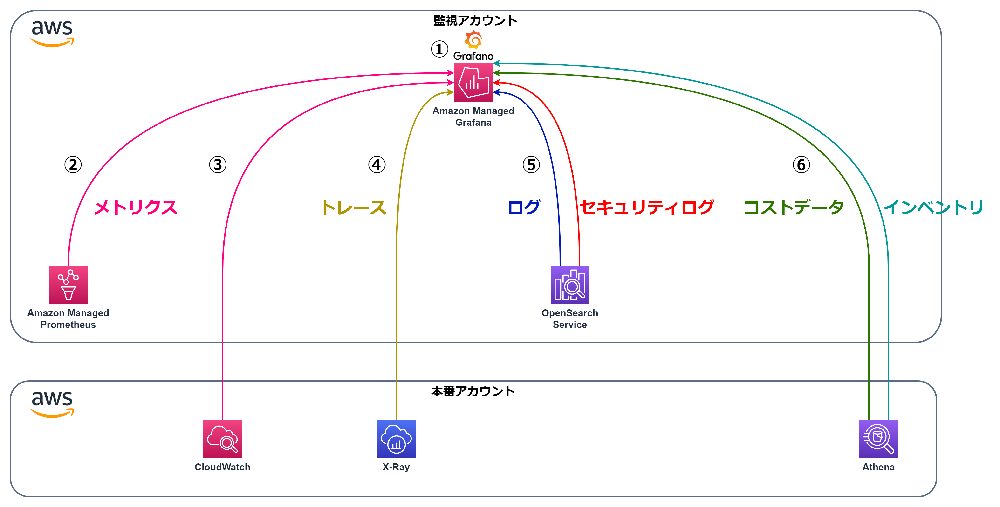

# **監視の構築手順**
- [メトリクスの取得手順](#メトリクスの取得手順)
- [ログの取得手順](#ログの取得手順)
- [トレースの取得手順](#トレースの取得手順)
- [セキュリティログの取得手順](#セキュリティログの取得手順)
- [Athenaの設定](#athenaの設定)
- [Grafanaの設定](#grafanaの設定)

## **メトリクスの取得手順**
メトリクスの取得から可視化までの手順です。 
流れとしては以下の画像の通りです。  
 

それぞれの導入方法と設定方法についての手順を説明いたします。   
**①[Prometheus Exporter (Linux)](md/Prometheus_Exporter(Linux).md)** / **[Prometheus Exporter (Windows)](md/Prometheus_Exporter(Windows).md)**  
**②[AWS Distro for OpenTelemetry (Linux)](md/ADOT(Linux).md)** / **[AWS Distro for OpenTelemetry (Windows)](md/ADOT(Windows).md)** / **[AWS Distro for OpenTelemetry (ECS)](md/ADOT(ECS).md)**  
**③[IAM Role](md/IAM(AMP).md)**   
**④[Amazon Managed Service for Prometheus](md/AMP.md)**  
**⑤[Amazon Managed Grafana](#grafanaの設定)**  

 
※クリックで画像表示 

## **ログの取得手順**
ログの取得から可視化までの手順です。 
流れとしては以下の画像の通りです。  
 

それぞれの導入方法と設定方法についての手順を説明いたします。   
**①[Fluent Bit(Linux)](md/FluentBit(Linux).md)** / **[Fluent Bit(Windows)](md/FluentBit(Windows).md)** / **[Fluent Bit(ECS)](md/FluentBit(ECS).md)**  
**②[IAM Role](md/IAM(S3).md)**  
**③[SIEM on OpenSearch Serviceのインストール](md/SIEM.md)**  
**④[SIEM on OpenSearch Serviceの設定](md/SIEM(設定).md)**  
**⑤[Amazon Managed Grafana](#grafanaの設定)**  

 
※クリックで画像表示 

## **トレースの取得手順**
トレースの取得から可視化までの手順です。 
流れとしては以下の画像の通りです。  
 

それぞれの導入方法と設定方法についての手順を説明いたします。   
**①[OpenTelemtry SDK(C#)](md/OtelSDK(C#).md)** / **[OpenTelemtry SDK(PHP)](md/OtelSDK(PHP).md)**  
**②[AWS Distro for OpenTelemetry](md/ADOT(トレース).md)**  
**③[Amazon Managed Grafana](#grafanaの設定)**  

 
※クリックで画像表示 

## **セキュリティログの取得手順**
セキュリティログの取得から可視化までの手順です。 
流れとしては以下の画像の通りです。  
 

それぞれの導入方法と設定方法についての手順を説明いたします。   
**①[セキュリティサービスのログの取り込み設定](md/SIEM(セキュリティ).md)**  
**②[Amazon Managed Grafana](#grafanaの設定)**

## Athenaの設定
コストデータとサーバーのインベントリデータをGlueでテーブル作成し、Athenaでのクエリ出来るようにするまでの手順です。 
流れとしては以下の画像の通りです。  
 

それぞれの導入方法と設定方法についての手順を説明いたします。   
**①[Cost and Usage Report](md/CUR.md)**  
**②[Systems Manager Inventory](md/Inventry.md)**  
**③[Amazon Managed Grafana](#grafanaの設定)**

## **Grafanaの設定**
 

Grafanaの導入方法と設定方法についての手順を説明いたします。   
**①[Amazon Managed Grafanaの作成](md/AMG.md)**  
**②[データソースの設定(Prometheus)](md/AMG(AMP).md)**  
**③[データソースの設定(CloudWatch)](md/AMG(CW).md)**  
**④[データソースの設定(X-Ray)](md/AMG(XRay).md)**  
**⑤[データソースの設定(OpenSearch)](md/AMG(OS).md)**  
**⑥[データソースの設定(Athena)](md/AMG(Athena).md)**  

## **アラートの設定**
Grafanaにてメトリクスやログのアラートを発報し、メールを送信したりコマンドを実行する手順です。 
流れとしては以下の画像の通りです。  
 
それぞれの導入方法と設定方法についての手順を説明いたします。   

**①[Amazon Managed Grafanaでのアラート設定](md/AMGアラート.md)**  
**②[SNS](md/SNS.md)**  
**③[Lambda](md/Lambda.md)**  
