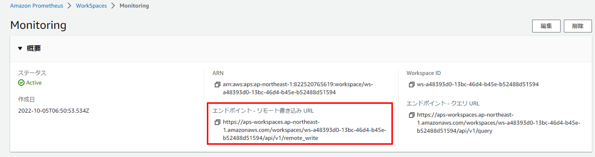
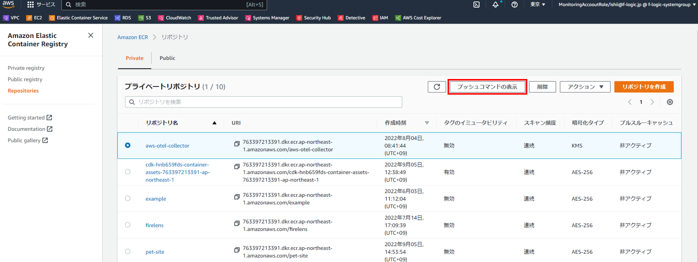
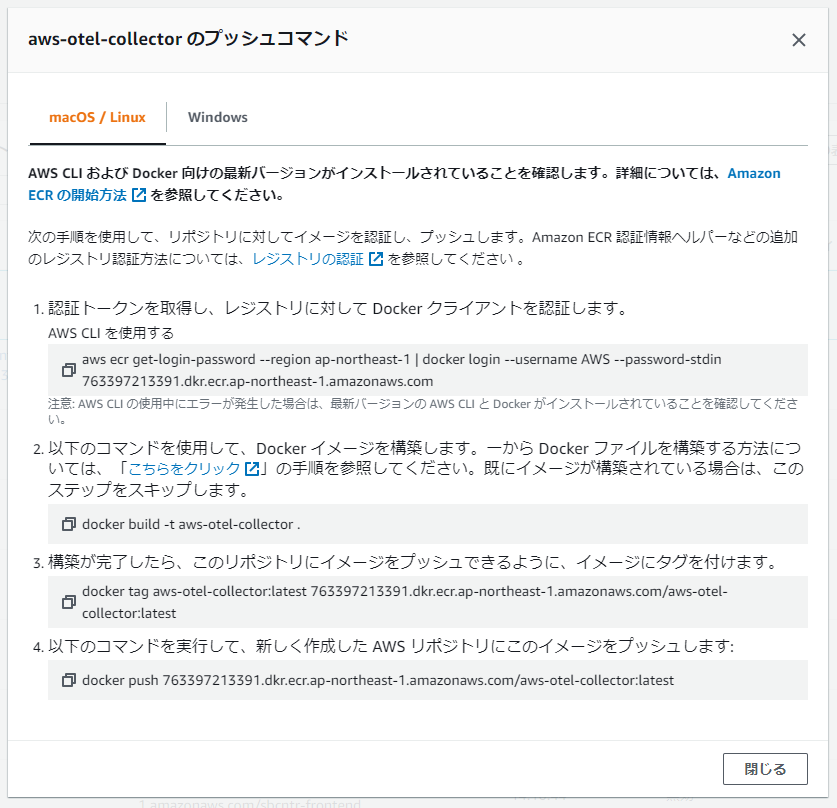
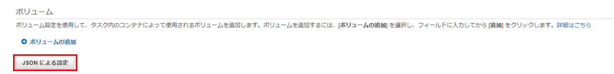
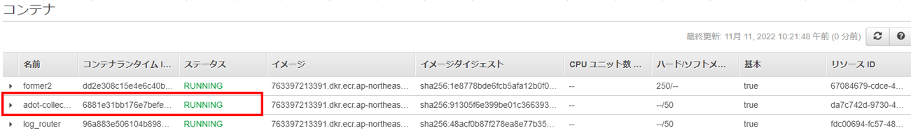

# **AWS Distro for OpenTelemetry (ECS)**
AWS Distro for OpenTelemetry(ADOT)をECSに導入する手順について説明します。<br><br><br>

まずADOTの設定ファイルを`config.yaml`というファイル名で用意します。<br>
AMPのリモート書き込みURLはAMPのマネジメントコンソール画面で確認できます。<br>

```yaml
receivers:
  awsecscontainermetrics:
    collection_interval: 10s
processors:
  filter:
    metrics:
      include:
        match_type: strict
        metric_names:
          - 取得したいメトリクス
          -         〃
          -         〃
          -         〃
exporters:
  prometheusremotewrite:
    endpoint: # AWS Managed Prometheus(AMP)のエンドポイント - リモート書き込み URL
    auth:
      authenticator: sigv4auth
    resource_to_telemetry_conversion:
      enabled: true
  awsxray:
    region: "ap-northeast-1"
extensions:
  health_check:
  pprof:
    endpoint: :1888
  zpages:
    endpoint: :55679
  sigv4auth:
    service: "aps"
    region: "ap-northeast-1"
service:
  extensions: [pprof, zpages, health_check]
  pipelines:
    metrics:
      receivers: [awsecscontainermetrics]
      processors: [filter]
      exporters: [prometheusremotewrite]
```
AMPのリモート書き込みURLはAMPのマネジメントコンソール画面で確認できます。<br>
<br><br>

次にDockerfileを用意します。<br>
```Dockerfile
FROM public.ecr.aws/aws-observability/aws-otel-collector:latest
COPY config.yaml /etc/ecs/config.yaml
CMD ["--config=/etc/ecs/config.yaml"]
```

Dockerfileとconfig.yamlを同じフォルダに配置してコンテナイメージを作成し、
作成したコンテナイメージをECRにプッシュします。<br>
イメージの作成とプッシュのコマンドについては、こちらで確認できます。<br>

<br>

<br>

続いて、ECSでのタスク定義で新しいディビジョンを作成し、`JSONによる設定`をクリックします。<br>

<br>

下記内容を追加します。
```json
{
  "name": "adot-collector",
  "image": "先ほどECRにプッシュしたADOTのイメージのURI",
  "essential": false,
  "logConfiguration": {
    "logDriver": "awslogs",
    "options": {
      "awslogs-group": "/ecs/ecs-adot-collector",
      "awslogs-region": "my-region",
      "awslogs-stream-prefix": "ecs",
      "awslogs-create-group": "True"
    }
  }
}
```

タスクロールにポリシー`AmazonPrometheusRemoteWriteAccess`をアタッチします。<br><br><br>

サービス更新をしてタスクを起動し直して、`adot-collector`コンテナが`RUNNING`になっていれば完了です。
<br>