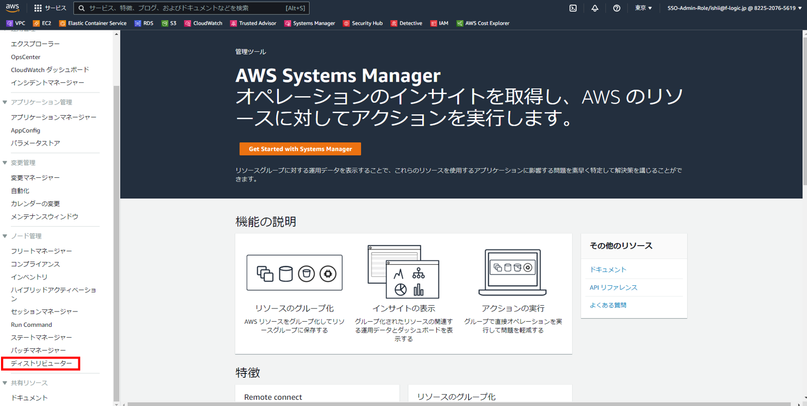
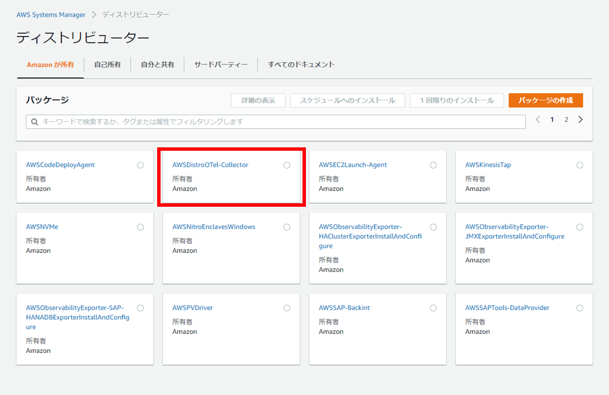
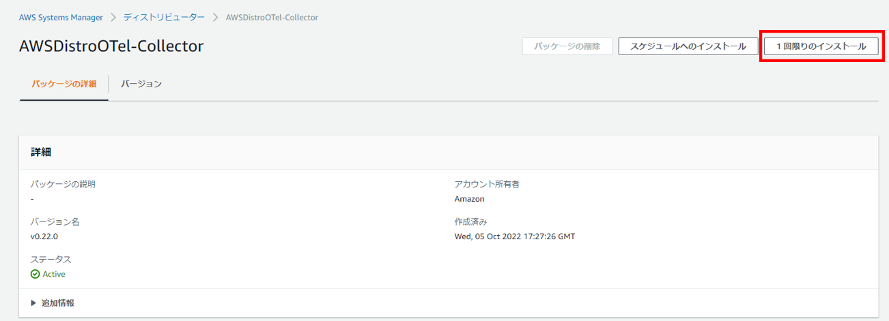
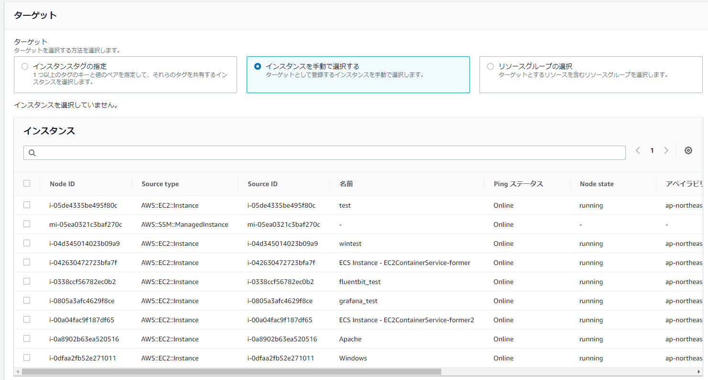
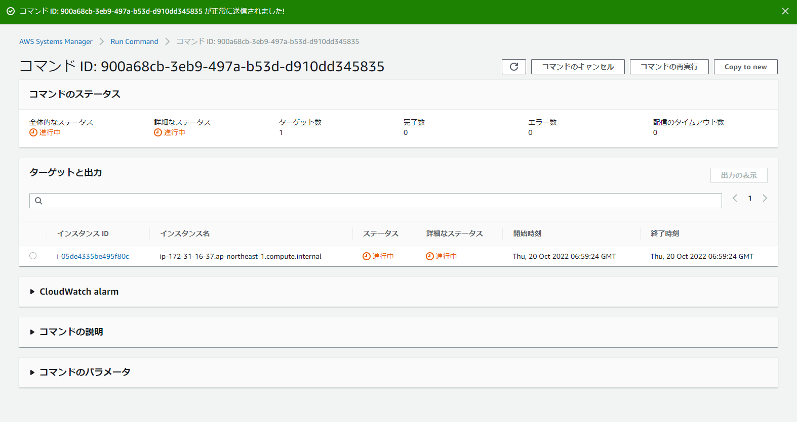
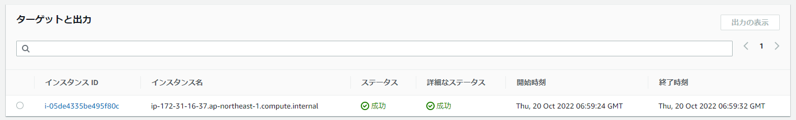

# **AWS Distro for OpenTelemetry (Windows)**
AWS Distro for OpenTelemetry(ADOT)をWindowsに導入する手順について説明します。<br><br><br>
まずAWSのマネジメントコンソールにてSystems Managerを開いて、左下のディストリビューターを選択してください。<br>

<br><br>

AWSDistroOtel-Collectorを選択します。<br>

<br>

一回限りのインストールをクリックします。<br>
<br>

コマンドを実行の画面になったら、ターゲットからインストールしたいインスタンスを選択してください。<br>
他の設定はデフォルトのままで大丈夫です。<br>
選択したら画面一番下にある実行をクリックします。<br>

<br>

実行すると、ステータスが進行中になります。<br>

<br>

ステータスが進行中から成功に変われば完了です。<br>

<br><br>

成功したらサーバーにログインし、`C:\Program Files\Amazon`に`AWSOTelCollector`があるかどうか確認してください。<br><br>

`AWSOTelCollector`フォルダの中にある`config.yaml`がADOTの設定ファイルです。
以下の様に設定ファイルを編集します。
```
receivers:
  prometheus:
    config:
      global:
        scrape_interval: 1m
        scrape_timeout: 10s
      scrape_configs:
      - job_name: "prometheus"
        static_configs:
        # Exporterのポート番号を下記のように記載
        - targets: [ localhost:2021 ] # Fluent Bit
        - targets: [ localhost:9182 ] # Windows Exporter
        - targets: [ localhost:9117 ] # Apache Exporter
processors:
  filter:
    metrics:
      include:
        match_type: strict
        metric_names:
          - 取得したいメトリクス
          -         〃
          -         〃
          -         〃
exporters:
  prometheusremotewrite:
    endpoint: # AWS Managed Prometheus(AMP)のエンドポイント
    auth:
      authenticator: sigv4auth
    resource_to_telemetry_conversion:
      enabled: true
extensions:
  health_check:
  pprof:
    endpoint: :1888
  zpages:
    endpoint: :55679
  sigv4auth:
    service: "aps"
    region: "ap-northeast-1"
    assume_role:
      arn: # 他アカウントのAMPを使用する権限を持ったIAMロールのARN
      sts_region: "ap-northeast-1"
service:
  extensions: [pprof, zpages, health_check, sigv4auth]
  pipelines:
    metrics:
      receivers: [awsecscontainermetrics]
      processors: [filter]
      exporters: [prometheusremotewrite]
```
AMPの作成については[こちら](AMP.md)、IAMロールの作成については[こちら](IAM(AMP).md)を確認してください。<br><br><br>
設定が完了したら、PowerShellでADOTを起動します。
```
PS> & '.\aws-otel-collector-ctl.ps1' -a start
```
下記コマンドで起動しているかどうか確認します。
```
PS> & '.\aws-otel-collector-ctl.ps1' -a status
```
起動出来ていれば、下記コマンドをコマンドプロンプトで実行して、ADOTの起動タイプをAutomaticに変更し、Windows ExporterとFluent BitをDependenciesに設定してください。
```
C:\>sc config "AWSOTelCollector" start= auto depend= "fluent-bit"/"Windows Exporter"
```