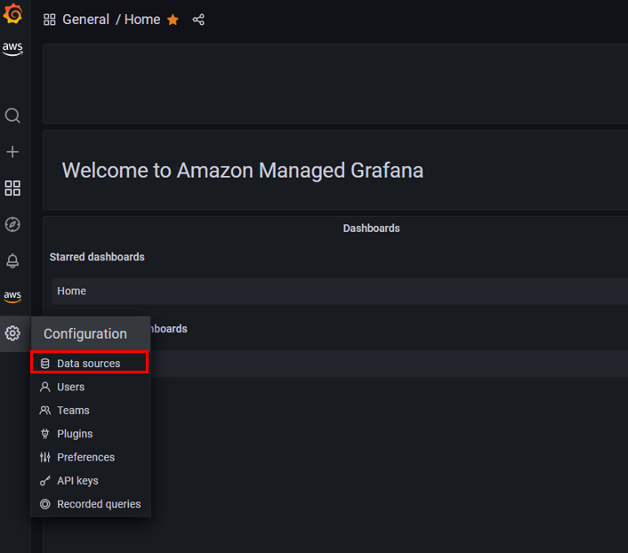
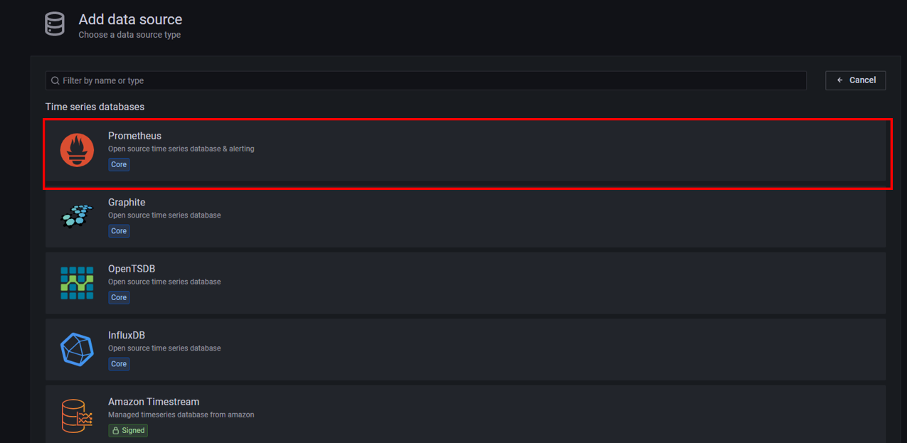
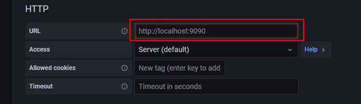
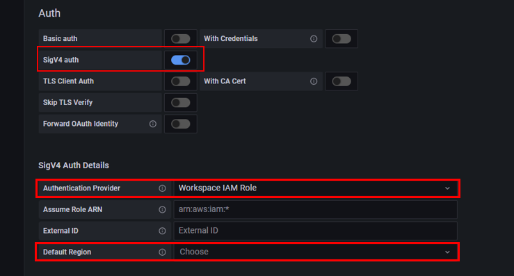
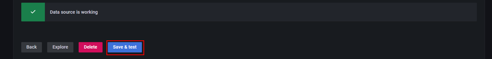
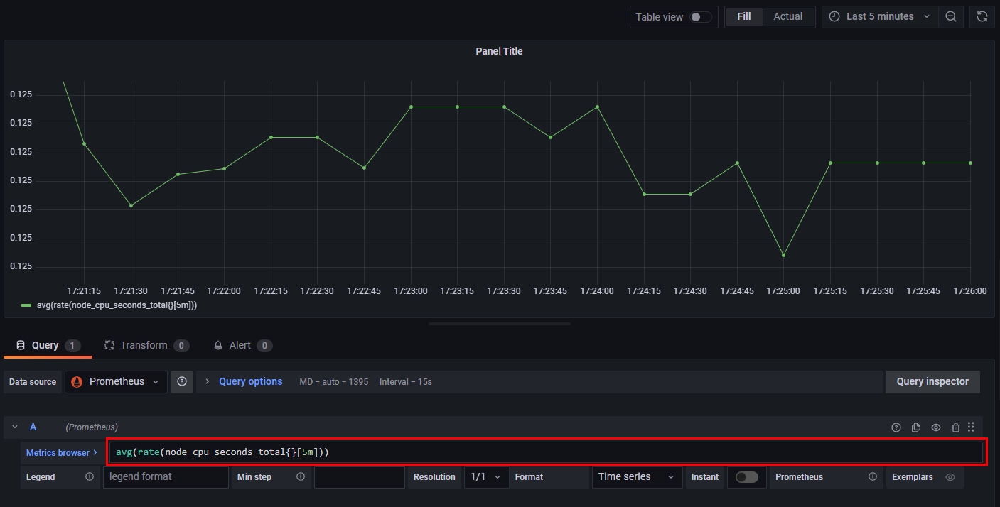

# Grafanaのデータソースの設定(Prometheus)
GrafanaにてデータソースにPrometheusを設定する方法について説明します。   

まずはGrafanaにて`Configuration`の`Data sources`を開きます。

 

`Add data source`をクリック 

 

`Prometheus`をクリック 

 

`URL`にAMPのURLを入力します。 

 

AMPのURLはAMPのマネジメントコンソール画面で確認できます。こちらのURLから末尾の`/api/v1/remote_write`を省いたものがAMPのURLです。 

  

次に`Auth`の`SigV4 auth`をOnにして、`SigV4 Auth Details`の`Authentication Provider`を`Workspace IAM Role`にし、`Default Region`でAMPのワークスペースを作成したリージョンを選択します。 

 

その他の設定はそのままで、`Save & test`をクリックします。 
`Data source is working`と表示されれば設定完了です。 

 

Prometheusのデータをもとに、ダッシュボードを作成する際は、`PromQL`というPrometheus用のクエリを使用します。 

 

