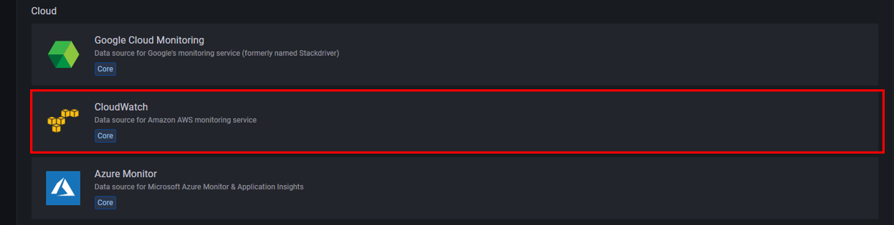
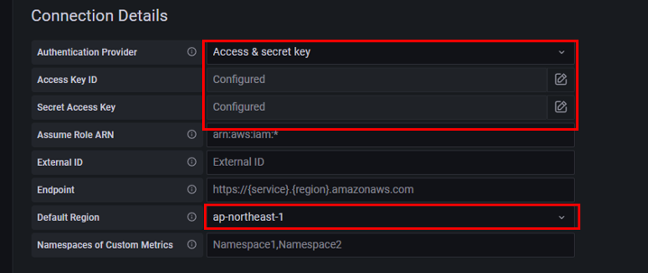

# Grafanaのデータソースの設定(CloudWatch)
GrafanaにてデータソースにCloudWatchを設定する方法について説明します。   

まずはGrafanaにて`Configuration`の`Data sources`を開きます。

 

`Add data source`をクリック 

 

`CloudWatch`をクリック 

 

`Authentication Provider`を`Access & secret key`にして、本番アカウントのユーザーの`Access Key`と`Secret Access Key`を入力します。ここでは`CloudWatchFullAccess`の権限を持ったユーザーのアクセスキーを使用しています。（権限は絞ってください。）

 

その他の設定はそのままで、`Save & test`をクリックします。 
`Data source is working`と表示されれば設定完了です。 

 