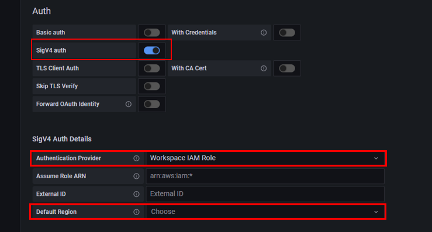
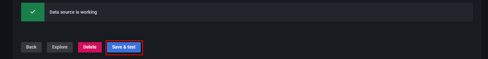

# Grafanaのデータソースの設定(OpenSearch)
GrafanaにてデータソースにOpenSearchを設定する方法について説明します。   

まずはGrafanaにて`Configuration`の`Data sources`を開きます。

 

`Add data source`をクリック 

 

`OpenSearch`をクリック 

 

`URL`にOpenSearchのURLを入力します。 

 

OpenSearchのURLはAmazon OpenSearch Serviceのマネジメントコンソール画面で確認できます。 

 

次に`Auth`の`SigV4 auth`をOnにして、`SigV4 Auth Details`の`Authentication Provider`を`Workspace IAM Role`にし、`Default Region`でAmazon OpenSearch Serviceのドメインを作成したリージョンを選択します。 

 

`OpenSearch details`の`Index name`にOpenSearchでのインデックス名を入力します。そのため、インデックス名ごとにOpenSearchのデータソースの設定が必要になります。 

 

その他の設定はそのままで、`Save & test`をクリックします。 
`Data source is working`と表示されれば設定完了です。 

 

OpenSearchのデータをもとに、ダッシュボードを作成する際は、`Lucene Query`を使用します。 

 