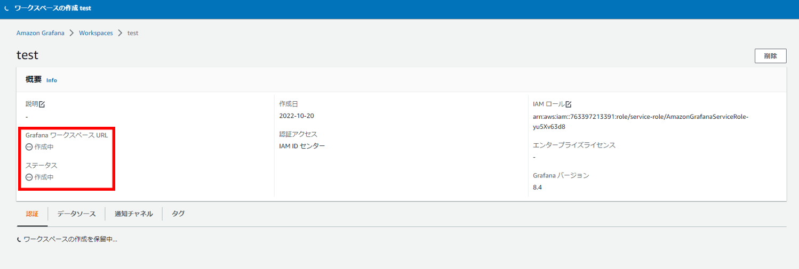

# **Amazon Managed Grafana**
GrafanaのAWSマネージドサービスである、Amazon Managed Grafana(AMG)の導入方法を説明します。   
まずAWSのマネジメントコンソールにてAMGを開いて、作成をクリックします。 

 

ワークスペース名に作成するAMGの名前を入力し、次へをクリックします。 

 

認証アクセスのAWS IAM IDセンターにチェックを入れて、次へをクリックします。 
※IAM Identity Centerの作成については[こちら](SSO.md)を参照。

 

サービスマネージド型のアクセス許可設定で、

 

Grafanaのデータソースとして使用したいサービスを選択して、次へをクリック 

 

確認画面になるので、間違いなければワークスペースを作成をクリック 

 

作成中になっているステータスが、

 

アクティブになれば作成完了です。
 