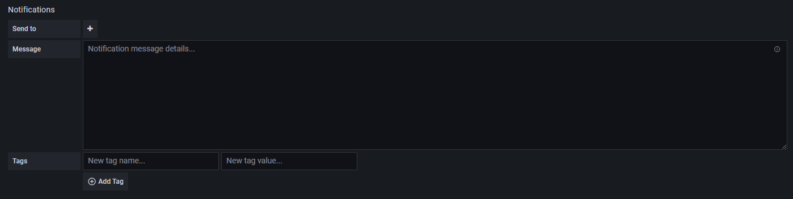

# Grafanaのアラート設定
Grafanaでのアラートの設定方法について説明します。   

まずアラートの送信先の設定です。Grafanaの左側から`Notification channels`を選択します。 

 

`New channel`をクリック。 

 

`Name`には適当な名前を入力し、`Type`は`AWS SNS`を選択して、`Topic`にはSNSトピックのArnを入力してください。SNSの作成については[こちら](SNS.md)です。 
`Auth Provider`は`Access & secret key`を選択し、本番アカウントのSNSを発行する権限を持ったユーザーの`Access Key`と`Secret Key`を入力します。（ユーザーの権限は絞ってください。） 
最後に左下の`Save`をクリックします。 

 

次にダッシュボードのパネル作成画面で`Alert`を選択します。 
PrometheusのメトリクスやOpenSearchのログ等を元にアラートを発報するので、まずはメトリクスやログの`Query`を設定しておいてください。 
※データソースの設定にてクエリについて記載しています 

 
各項目についてです 
**`Name`** : アラートの名前です 
**`Evcaluate every`** : アラートの評価間隔です 
**`For`** : ここで指定した期間アラートの通知を保留します 
**`WHEN`** : アラートの条件です `avg()`以外にも`max()`や`count()`などが選択できます 
**`OF`** : `query(A, 5m, now)`は`Query`の`A`の現在時刻から 5 分前までを監視対象とする設定です 
**`IS ABOVE`** : 閾値の設定です `IS ABOVE`以外にも`IS BELOW`や`IS WITHIN RANGE`などが選択できます 
**`If no data or all values are null`** : データが無いか全ての値が Null の時のアラートの状態の設定です 
**`If execution error or timeout`** : システムエラーやタイムアウト時のアラートの状態の設定です 

 
**`Send to`** : 先ほど設定したアラートの送信先です 
**`Message`** : 送信するメールの内容です 
**`Tags`** : 分かりやすいようにタグ付けします   

すべて入力したら右上の`Apply`をクリックします。 