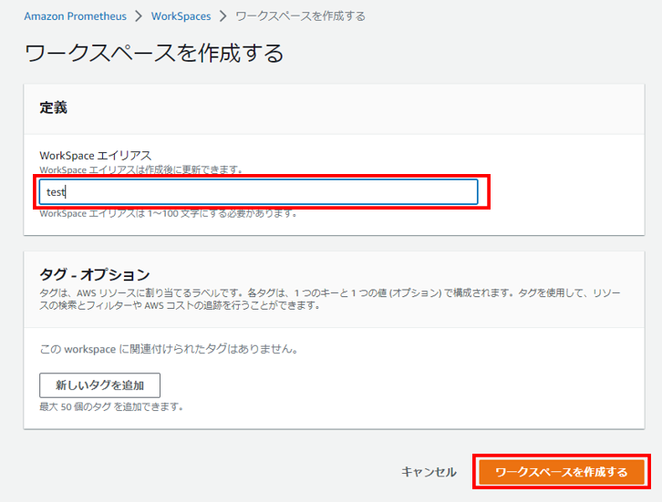

# **Amazon Managed Service for Prometheus**
PrometheusのAWSマネージドサービスである、Amazon Managed Prometheus(AMP)の導入方法を説明します。   
まずAWSのマネジメントコンソールにてAMPを開いて、作成をクリックします。 

 

WorkSpaceエイリアスに作成するAMPの名前を入力し、ワークスペースを作成するをクリックします。 

 

ステータスのCreateingが 

 

Activeになれば作成完了です。 
 