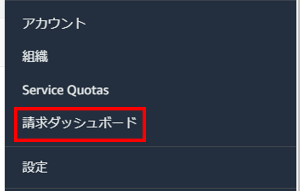
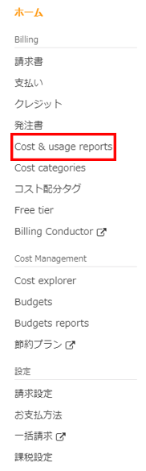
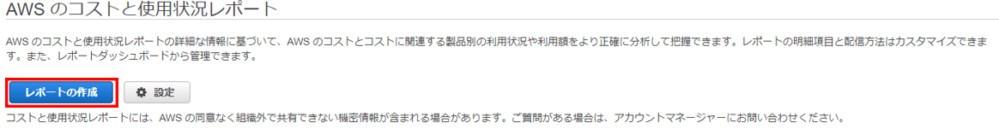
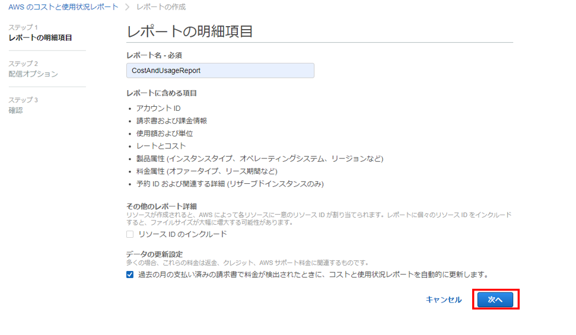
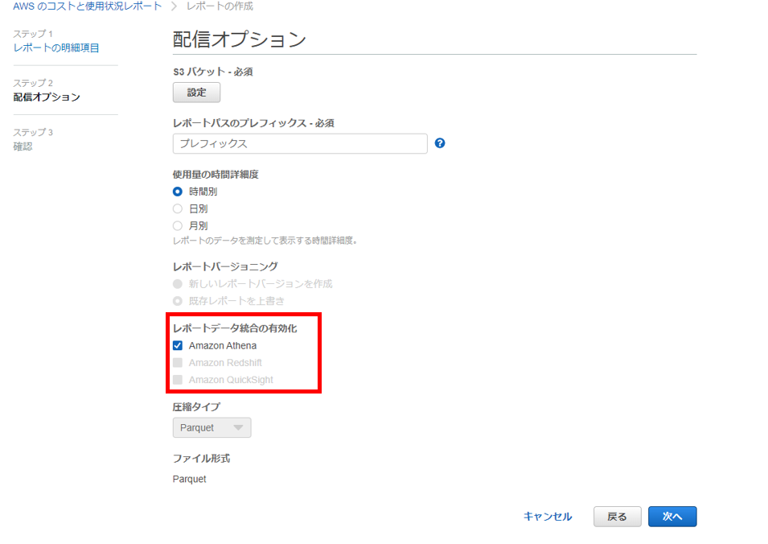

# Cost And Usage Reports
Cost And Usage ReportsをAthenaで確認する設定方法です。   

まずはAWSマネジメントコンソールの右上から、請求ダッシュボードを開きます 

 

`Cost & usage reports`をクリックします。

 

`レポートの作成`をクリックします。 

 

適当に名前を決め、次へをクリック 

 

レポートを保存するS3バケットとバケットでのパス、使用料の時間詳細度を設定し、
レポートデータ統合の有効化を`Amazon Athena`に設定します。 
あとは次へをクリックしてそのままレポートを作成してください。 

 

翌日にCost And Usage Reportsのレポートが作成され、コスト情報をAthenaで確認できるようになります。 