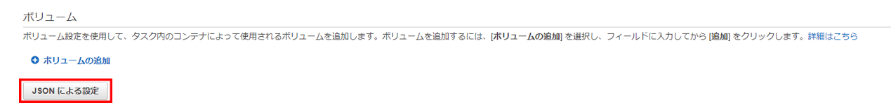

# Fluent Bit (ECS)
ログを取得してエクスポートするFluent BitのECSでの導入方法を説明いたします。<br><br><br>


まずFluent Bitの設定ファイルを`fluent-bit.conf`というファイル名で用意します。<br>
```conf
[SERVICE]
		Flush 1
		Grace 30
[FILTER]
		Name grep
		Match *-firelens-*
		Exclude log ^(?=.*ELB-HealthChecker\/2\.0).*$
[OUTPUT]
		Name 	kinesis_firehose
		Match *
		region ap-northeast-1
		delivery_stream flbase-prod-ecs-logs-stream
```

次にDockerfileを用意します。<br>
```Dockerfile
FROM public.ecr.aws/aws-observability/aws-for-fluent-bit:2.21.1
COPY ./fluent-bit.conf /fluent-bit/etc/fluent-bit.conf
```

Dockerfileとconfig.yamlを同じフォルダに配置してコンテナイメージを作成し、
作成したコンテナイメージをECRにプッシュします。<br>
イメージの作成とプッシュのコマンドについては、こちらで確認できます。<br>

<br>

<br>

続いて、ECSでのタスク定義で新しいディビジョンを作成し、`FireLensの統合を有効にする`にチェックを入れます。タイプは`fluentbit`、イメージはECRにアップした先ほどのイメージのURIを入力します。<br>

<br>

コンテナの定義からアプリコンテナを編集し、ログ設定をawslogsからawsfirelensに変更します。

<br>

Fluent Bitのコンテナは`log_router`というコンテナ名で追加されているので、こちらのログ設定はawslogsで、Fluent Bitのログを出力するCLoudWatchでのロググループ、リージョン、ログに付けるプレフィックスの設定を追加します。

<br>

Fluent Bitの設定ファイルの指定が必要なので、`JSONによる設定`をクリックします。<br>

<br>


アプリコンテナの`logConfiguration`の`option`が`null`になってるか確認してください。
```json
"logConfiguration": {
　　"logDriver": "awsfirelens",
　　"secretOptions": null,
　　"options": null
},
```

`firelensConfiguration`の項目を、以下のように変更して、設定ファイルを指定します。
```diff
"firelensConfiguration": {
    "type": "fluentbit"
+    "options": {
+        "config-file-type": "file",
+        ""config-file-value": "/fluent-bit/etc/fluent-bit.conf"　
+    }
 },
```

`essential`を`false`にすることでFluent Bitのコンテナが終了しても、アプリコンテナが終了しないようにします。
```diff
- "essential": true,
+ "essential": false,
```


タスクロールにポリシー`AmazonS3FullAccess` `CloudWatchLogsFullAccess`をアタッチします。<br><br><br>

サービス更新をしてタスクを起動し直して、`log_router`コンテナが`RUNNING`になっていれば完了です。
<br>