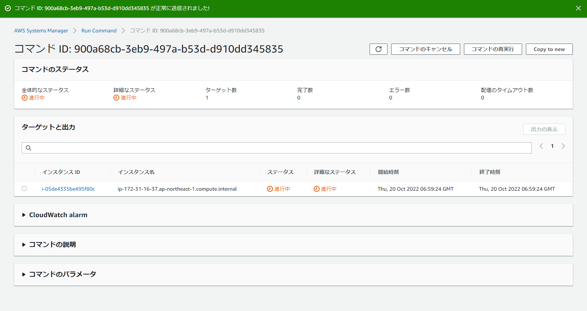

# Fluent Bit (Linux)
ログを取得してエクスポートするFluent BitのLinuxでの導入方法を説明いたします。<br><br><br>
まずAWSのマネジメントコンソールにてSystems Managerを開いて、左下のドキュメントを選択してください。<br>

<br><br>

自己所有を選択し、`InstallFluentBit`を選択します。<br>

<br><br>

コマンドを実行するをクリックします。<br>
<br><br>

コマンドを実行の画面になったら、ターゲットからインストールしたいインスタンスを選択してください。<br>
他の設定はデフォルトのままで大丈夫です。<br>
選択したら画面一番下にある実行をクリックします。<br>

<br>

実行すると、ステータスが進行中になります。<br>

<br>

ステータスが進行中から成功に変われば完了です。<br>

<br><br>

成功したらサーバーにログインし、`/etc/`に`fluent-bit`があるかどうか確認してください。
```
# cd /etc/
# ls
fluent-bit
```
`fluent-bit`ディレクトリの中にある`fluent-bit.conf`がADOTの設定ファイルです。
```
# cd fluent-bit/
# ls
fluent-bit.conf  parsers.conf  plugins.conf
```
`fluent-bit.conf`を編集します。
```
# vi fluent-bit.conf
```

以下の様に設定ファイルを編集します。
```diff
- [INPUT]
-     name cpu
-     tag  cpu.local
-
-     # Read interval (sec) Default: 1
-     interval_sec 1
-
- [OUTPUT]
-     name  stdout
-     match *
+ [INPUT]
+     name  tail
+     tag   log
+     path  # ログのパス
+
+ [OUTPUT]
+     Name                         s3
+     Match                        log
+     bucket                       # ログを送信するバケット名
+     region                       ap-northeast-1
+     total_file_size              250M
+     upload_timeout               1s
+     log_key                      log
+     use_put_object               on
+     compression                  gzip
+     content_type                 application/gzip
+     s3_key_format                /AWSLogs/アカウントID/フォルダ名/%Y/%m/%d/$UUID.gz
+
+ [INPUT]
+     name  tail
+     tag   opentelemetry
+     path  /opt/aws/aws-otel-collector/logs/aws-otel-collector.log
+
+ [FILTER]
+     Name     grep
+     Match    opentelemetry
+     Exclude  log ^(.+\/.+\/.+)
+
+ [OUTPUT]
+     Name                         s3
+     Match                        opentelemetry
+     bucket                       # ログを送信するバケット名
+     region                       ap-northeast-1
+     total_file_size              250M
+     upload_timeout               1s
+     log_key                      log
+     use_put_object               on
+     compression                  gzip
+     s3_key_format                /AWSLogs/アカウントID/フォルダ名/%Y/%m/%d/+ $UUID.gz
+
+ [INPUT]
+     name            fluentbit_metrics
+     tag             internal_metrics
+     scrape_interval 60s
+
+ [OUTPUT]
+     name            prometheus_exporter
+     match           internal_metrics
+     host            0.0.0.0
+     port            2021
```  9100
```

設定が完了したら、Fluent Bitを起動し、
```
# systemctl start fluent-bit
```
起動しているかどうか確認してください。
```
# systemctl status fluent-bit
```
起動していればFluent Bitの準備は完了です。