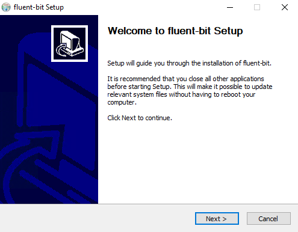
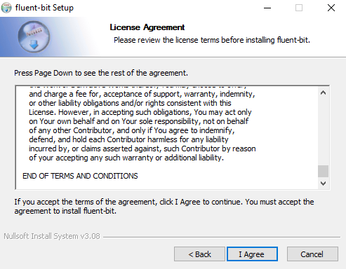
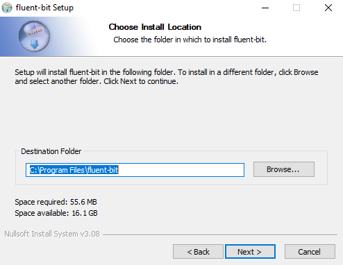
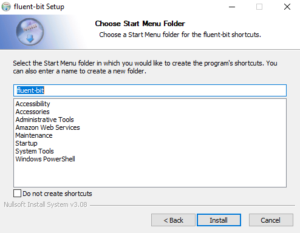
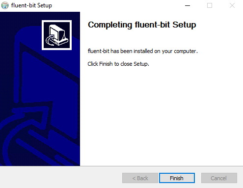

# Fluetn Bit (Windows)
ログを取得してエクスポートするFluent BitのWIndowsでの導入方法を説明いたします。<br><br><br>

まずは[こちら](https://docs.fluentbit.io/manual/installation/windows)から最新のwin64.exeをサーバーにインストールしてください<br>

インストールしたらexeファイルを実行し、以下の画面になるので`Next`をクリックします。<br>

<br><br>

`I Agree`をクリックします。<br>

<br><br>

`Next`をクリックします。<br>

<br><br>

`Install`をクリックします。<br>

<br><br>

`Finish`をクリックして完了してください。<br>

<br><br>

`C:\Program Files\fluent-bit\`が作成されているか確認します<br><br>

`C:\Program Files\fluent-bit\conf\fluent-bit.conf`がFluent Bitの設定ファイルなので、
以下の様に編集します。
```diff
- [INPUT]
-     name cpu
-     tag  cpu.local
-
-     # Read interval (sec) Default: 1
-     interval_sec 1
-
- [OUTPUT]
-     name  stdout
-     match *
+ [INPUT]
+     Name         winlog
+     Channels     Setup,Windows PowerShell
+     tag          winlog
+     Interval_Sec 1
+ [OUTPUT]
+     Name                         s3
+     Match                        winlog
+     bucket                       # ログを送信するバケット名
+     region                       ap-northeast-1
+     total_file_size              250M
+     upload_timeout               1s
+     log_key                      log
+     use_put_object               on
+     compression                  gzip
+     content_type                 application/gzip
+     s3_key_format                /AWSLogs/アカウントID/フォルダ名/%Y/%m/%d/$UUID.gz
+ [INPUT]
+     name  tail
+     tag   log
+     path  # ログのパス
+
+ [OUTPUT]
+     Name                         s3
+     Match                        log
+     bucket                       # ログを送信するバケット名
+     region                       ap-northeast-1
+     total_file_size              250M
+     upload_timeout               1s
+     log_key                      log
+     use_put_object               on
+     compression                  gzip
+     content_type                 application/gzip
+     s3_key_format                /AWSLogs/アカウントID/フォルダ名/%Y/%m/%d/$UUID.gz
+
+ [INPUT]
+     name  tail
+     tag   opentelemetry
+     path  /opt/aws/aws-otel-collector/logs/aws-otel-collector.log
+
+ [FILTER]
+     Name     grep
+     Match    opentelemetry
+     Exclude  log ^(.+\/.+\/.+)
+
+ [OUTPUT]
+     Name                         s3
+     Match                        opentelemetry
+     bucket                       # ログを送信するバケット名
+     region                       ap-northeast-1
+     total_file_size              250M
+     upload_timeout               1s
+     log_key                      log
+     use_put_object               on
+     compression                  gzip
+     s3_key_format                /AWSLogs/アカウントID/フォルダ名/%Y/%m/%d/+ $UUID.gz
+
+ [INPUT]
+     name            fluentbit_metrics
+     tag             internal_metrics
+     scrape_interval 60s
+
+ [OUTPUT]
+     name            prometheus_exporter
+     match           internal_metrics
+     host            0.0.0.0
+     port            2021
```

完了したらコマンドプロンプトで下記コマンドを実行し、Fluent Bitをサービス登録します。
```
C:¥>sc create  fluent-bit binPath= "\"C:\Program Files\fluent-bit\bin\fluent-bit.exe\" -c \"C:\Program Files\fluent-bit\conf\fluent-bit.conf\"" start= auto
```