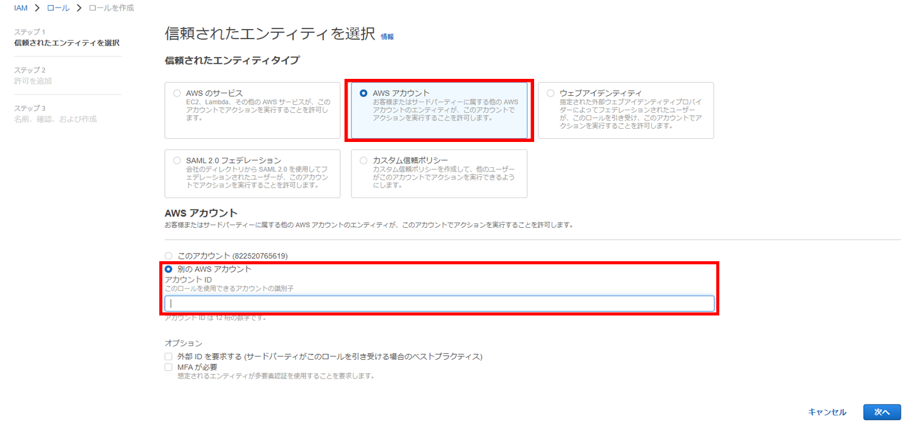

# IAMロールの設定(ADOT➡Prometheus)
本番アカウントのADOTから監視アカウントのPrometheusにメトリクスを送信するためのIAMロールの設定方法を説明します。<br><br><br>

まず監視アカウントにてIAMロールを作成します。<br>
信頼されたエンティティタイプを`AWSアカウント`にし、本番アカウントのアカウントIDを入力します。<br>

<br>

ポリシーは`AmazonPrometheusRemoteWriteAccess`を追加します。<br>

<br>

あとはロール名を入力し、ロールを作成をクリックします。今回はロール名を`AMP-XAccount-Role-641264638977`にしています。

<br>

次に本番アカウントに移動します。<br>
ADOTがインストールされているインスタンスに付与されているIAMロールを編集してください。<br><br><br>


`インラインポリシーを作成`をクリックします。

<br>

下記内容を追加してください。
```json
　　　　{
            "Sid": "1",
            "Effect": "Allow",
            "Action": "sts:AssumeRole",
            "Resource": "先ほど作成した監視アカウントでのロールのArn"
        }
```

<br>

あとは適当に名前を入力し、ポリシーを作成します。

<br>

