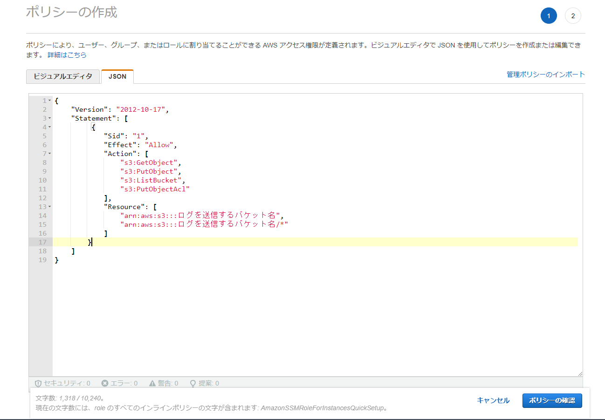
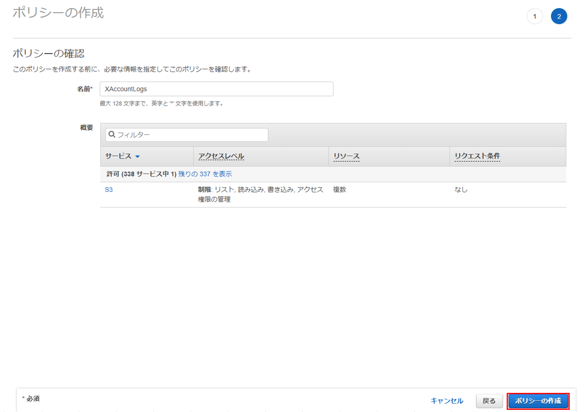
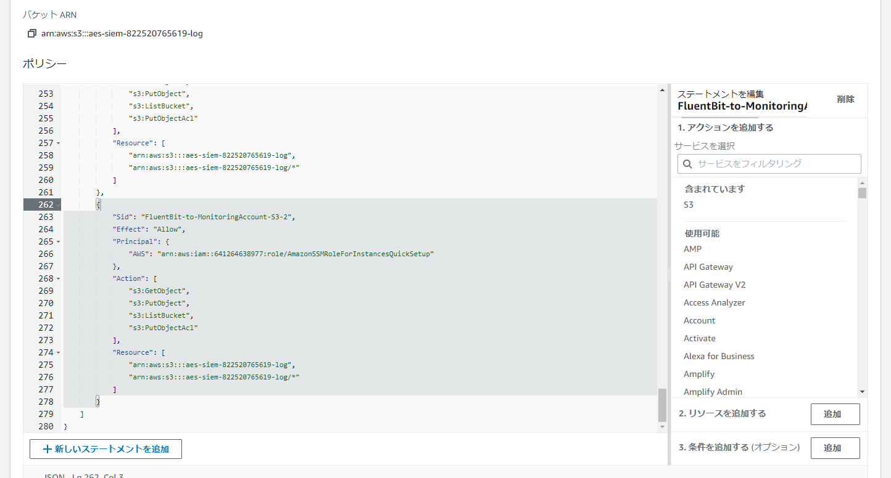

# IAMロールの設定(Fluent Bit➡S3)
本番アカウントのFluent Bitから監視アカウントのS3にログを送信するためのIAMロールの設定方法を説明します。<br><br><br>

まず本番アカウントのFluent BitがインストールされているインスタンスのIAMロールを編集します。<br><br><br>

`インラインポリシーを作成`をクリックします。

<br>

下記内容を追加してください。
```json
　　　　{
            "Sid": "1",
            "Effect": "Allow",
            "Action": [
                "s3:GetObject",
                "s3:PutObject",
                "s3:ListBucket",
                "s3:PutObjectAcl"
            ],
            "Resource": [
                "arn:aws:s3:::ログを送信するS3バケット名",
                "arn:aws:s3:::ログを送信するS3バケット名/*"
            ]
        }
```

<br>

あとは適当に名前を入力し、ポリシーを作成します。<br>

<br>

次に監視アカウントに移動します。<br>
ログを送信したいS3バケットのバケットポリシーを編集します。<br><br><br>

下記内容を追加してください。
```json
　　　　{
			"Sid": "1",
			"Effect": "Allow",
			"Principal": {
				"AWS": "Fluent BitがインストールされているインスタンスのIAMロールのArn"
			},
			"Action": [
				"s3:GetObject",
				"s3:PutObject",
				"s3:ListBucket",
				"s3:PutObjectAcl"
			],
			"Resource": [
				"arn:aws:s3:::ログを送信するS3バケット名",
				"arn:aws:s3:::ログを送信するS3バケット名/*"
			]
		}
```

<br>

変更を保存して完了です。