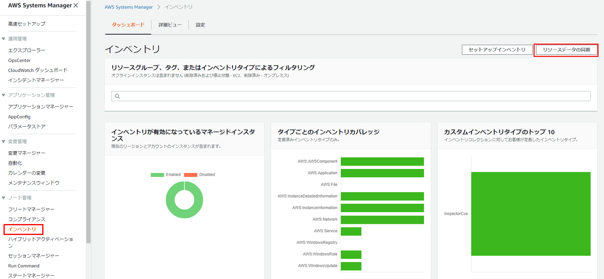
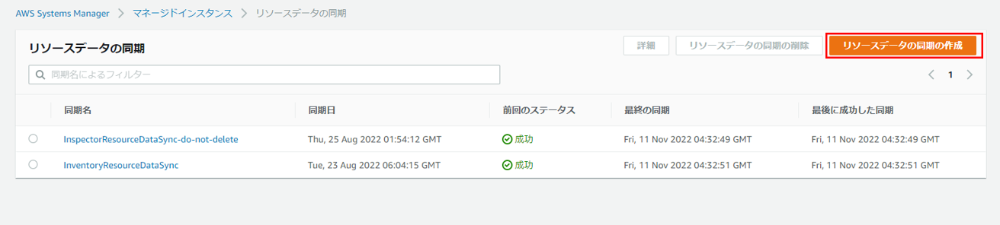
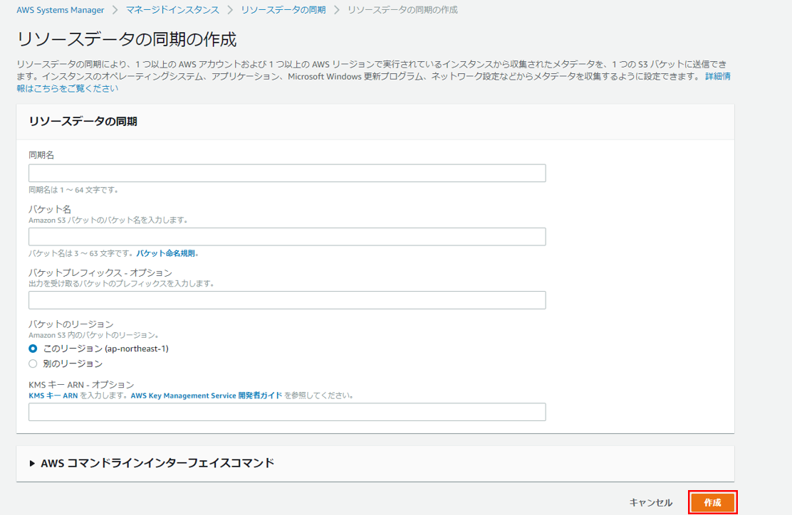

# Systems Manager Inventory

サーバー内のメタデータを取得するSystems Manager Inventoryの設定方法について説明します。   

まずAWSマネジメントコンソールでSystems Managerの`インベントリ`を開き、`リソースデータの同期`をクリックします。 

 

`リソースデータの同期の作成`をクリック。

 

同期名は適当な名前を入力し、データを保存するS3バケットとバケット上でのフォルダパス、バケットのリージョンを設定。KMSは別途作成したKMSのArnを入力して作成をクリックしてください。

 

これで、サーバーのインベントリデータがS3に出力され、Athenaで確認できるようになります。 