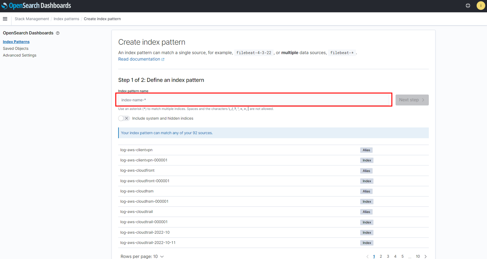

# SIEM on OpenSearch Serviceの設定方法
<br>

## Lambdaの設定

SIEM on OpenSearch Serviceの設定についてです。<br>
まずはLambdaでのログの取り込み設定です。<br><br><br>

Lambdaを開き、`aes-siem-es-loader`という関数を開きます。<br>
`user.ini.sample`というファイルがあるりますが、それとは別に`user.ini`というファイルを作成します。<br>

<br><br>

下記は設定の一例です。設定項目の詳細については`aws.ini`というファイルを参照してください。
```ini
[DEFAULT]
# デフォルトの設定を上書き
# index_rotation = auto

[windows]
index_name = log-windows　# OpenSearchでのインデックス名
s3_key = FluentBit        # S3でのフォルダ名
file_format = json        # ファイルの形式

[apache]
index_name = log-apache
s3_key = solamame/Apache
file_format = text
timestamp_key = datetime                 # タイムスタンプに設定するキー
timestamp_format = %d/%b/%Y:%H:%M:%S %z  # タイムスタンプのフォーマット
log_pattern = ^(?P<remotehost>.*) (?P<rfc931>.*) (?P<authuser>.*) \[(?P<datetime>.*?)\] \"(?P<request_method>[^ ]*) (?P<request_path>[^ ]*) (?P<request_version>HTTP\/.*)\" (?P<status>[^ ]*) (?P<bytes>[^ ]*) \"(?P<http_referer>.+)\" \"(?P<http_user_agent>.+)\"  # ログのパターン(正規表現)
```

## OpenSearchの設定
次はOpenSearchでインデックスの登録を行います。<br>
OpenSearchを開き、`Stack Management`を開きます。<br>

<br>

`Index Patterns`を開き、`Create Index Patterns`をクリックします。<br>

<br>

Lambdaで登録したインデックス名を入力します。インデックス名の後ろには日付が入るようになっているので、
```
log-apache-*
```
のように、正規表現を使用して登録します。この時ログがちゃんと取れていないと、`Next Step`はクリックできません。<br>

<br>

Time fileldに設定するキーを選択して、`Create Index pattern`をクリックします。<br>

<br>

作成したら、`Discover`をクリックし、<br>

<br>

先ほど作成したログパターンを選択して、ログが取れているかどうか確認してください。
<br>