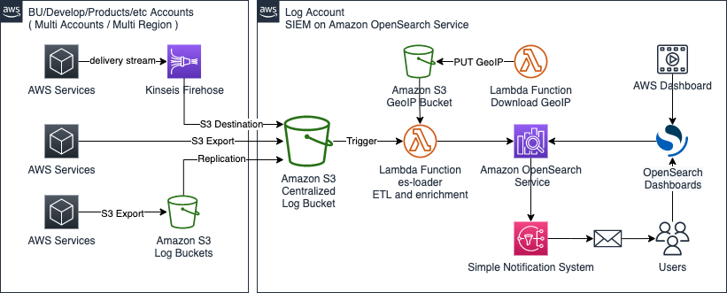
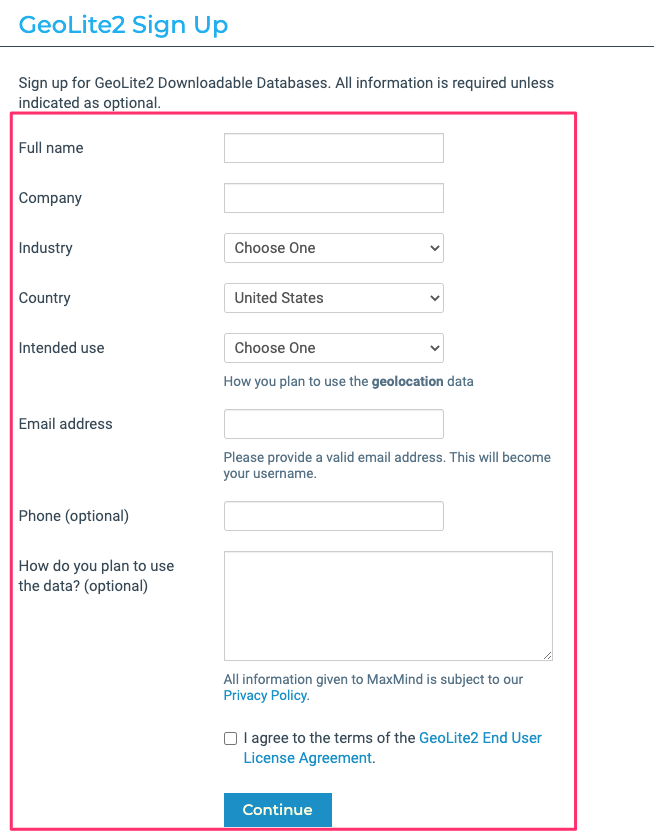
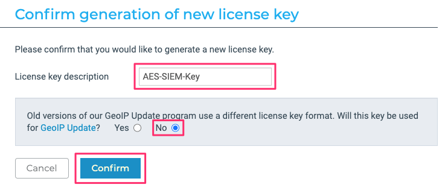
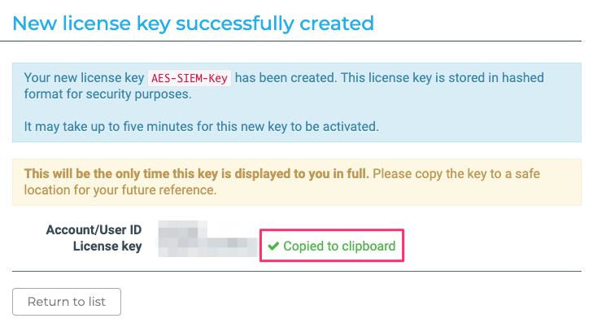
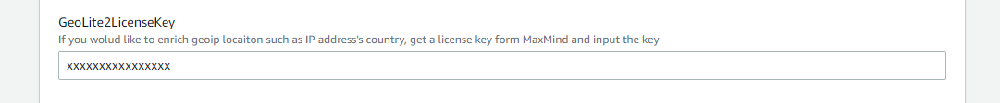
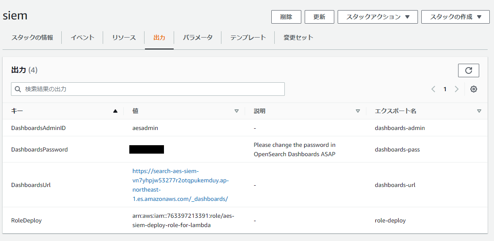

# SIEM on OpenSearch Service
>SIEM は Security Information and Event Management の略で、セキュリティ機器、ネットワーク機器、その他のあらゆる機器のデータを収集及び一元管理をして、相関分析によって脅威検出とインシデントレスポンスをサポートするためのソリューションです。OpenSearch Service は、オープンソースの OpenSearch と OpenDashboards を大規模かつ簡単でコスト効率の良い方法を使用してデプロイ、保護、実行する完全マネージド型サービスです。OpenSearch Service の環境に SIEM として必要な機能を実装したのが SIEM on Amazon OpenSearch Service です。

AWSより提供されているソリューションで、CloudFormationを使用することで、以下のような構成が構築されます。

  

[こちら](https://github.com/aws-samples/siem-on-amazon-opensearch-service/blob/main/README_ja.md)にCloudFormationのテンプレートのリンクや、作成方法が記載されています。 

[GeoLite2](https://dev.maxmind.com/geoip/geoip2/geolite2/)に登録する必要があります。GeoLite2はフリーでGeoIPのデータベースを提供しているサイトです。

まず、[サインアップ](https://www.maxmind.com/en/geolite2/signup)を開きます。必要な情報を入力して、次に進んでください。 
メールが届くので、パスワードを設定してログインしてください。 
  

左下の`My License Key`をクリックし、`Generate new license key`をクリックします。 
  

適当な名前を入力し、GeoIP Updateのチェックは`No`を選択して、`Confirm`をクリックします。 
  

License Keyが発行されるので、コピーします。画面を閉じたらKeyが確認できなくなるので、注意してください。 
  

つづいて、[こちら](https://github.com/aws-samples/siem-on-amazon-opensearch-service/blob/main/README_ja.md)にあるCLoudFormationテンプレートからCloudFormationスタックを作成します。   

パラメータに先ほど取得したLicense Keyを入力して、スタックを作成してください。

  

スタックを作成したら出力欄にOpenSearchのIDとパスワード、ログインURLが出力されます。 
初回ログインはこのユーザーでログインして設定してください。 
  