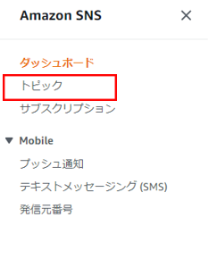
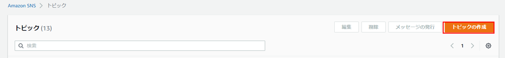
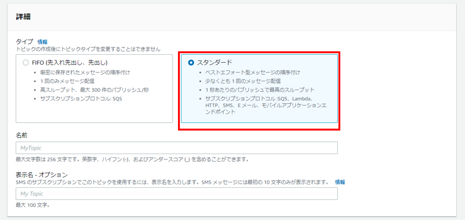
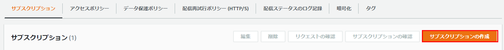
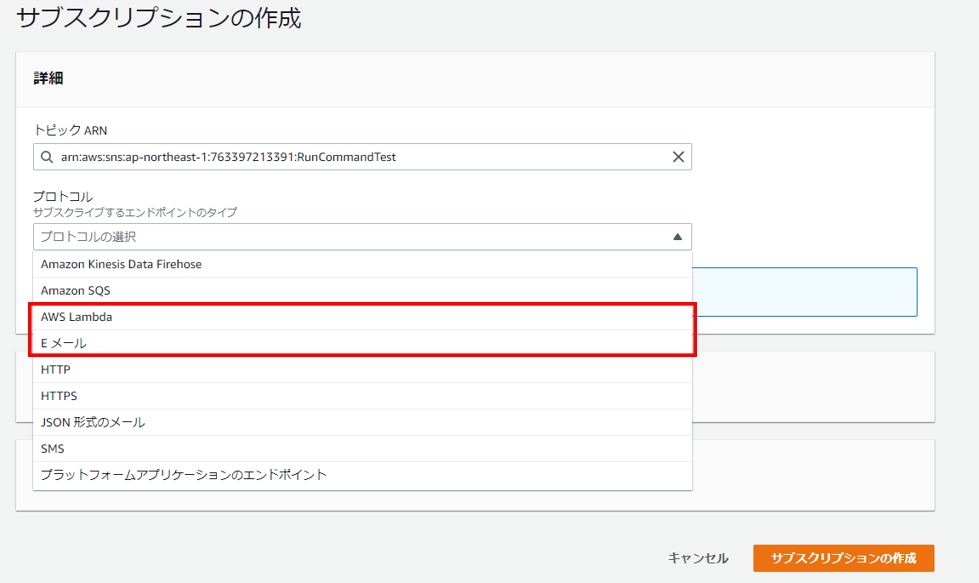
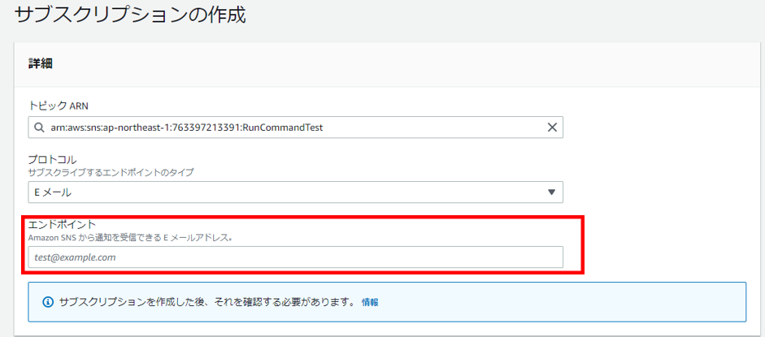
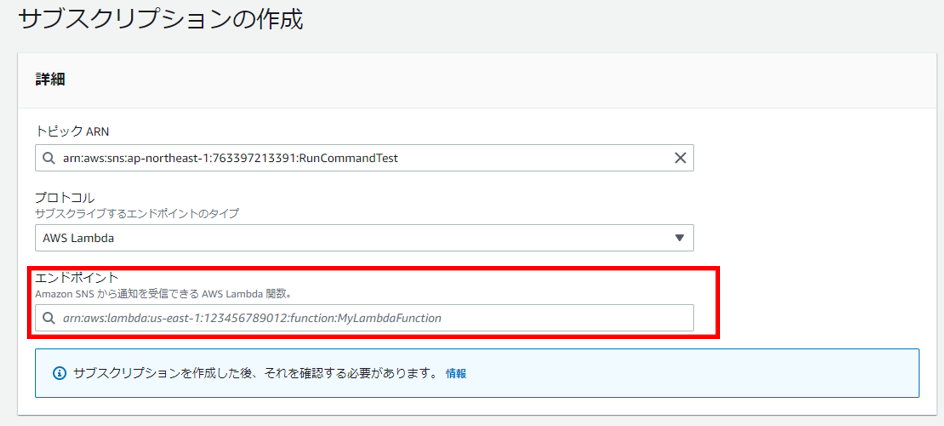
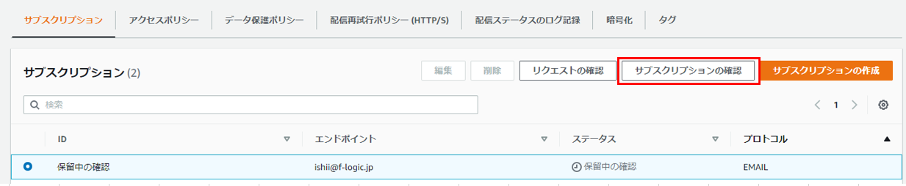
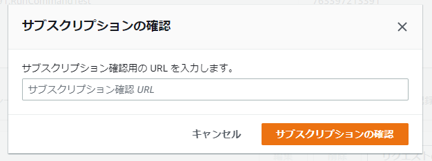

# SNS
Amazon SNSの設定方法について説明します。   

AWSマネジメントコンソールからSNSを開き、トピックを選択します。 

 

`トピックの作成`をクリックします。 

 

タイプは`スタンダード`を選択し、適当な名前と表示名を入力し、一番下の`トピックの作成`をクリックします。 

 

トピックを作成したら、トピックを開き`サブスクリプションの作成`をクリックします。 

 

プロトコルで`AWS Lambda`もしくは`Eメール`を選択します。

 

Eメールの場合はエンドポイントにEメールアドレスを、 

 

Lambdaの場合はエンドポイントにLambda関数のArnを入力します。Lambda関数の作成については[こちら](Lambda.md)です。

 

入力したら、右下の`サブスクリプションの作成`をクリックして完了です。 

Eメールの場合は承認が必要なので、サブスクリプションの欄から`保留中の確認`になっているものを選択し、`サブスクリプションの確認`をクリックします。
 

メールが届いていると思うので、届いたメールに`Confirm subscription`と記載されているリンクのURLをコピーして、`サブスクリプション確認URL`の欄に貼り付けます。`サブスクリプションの確認`をクリックして完了です。 
 

