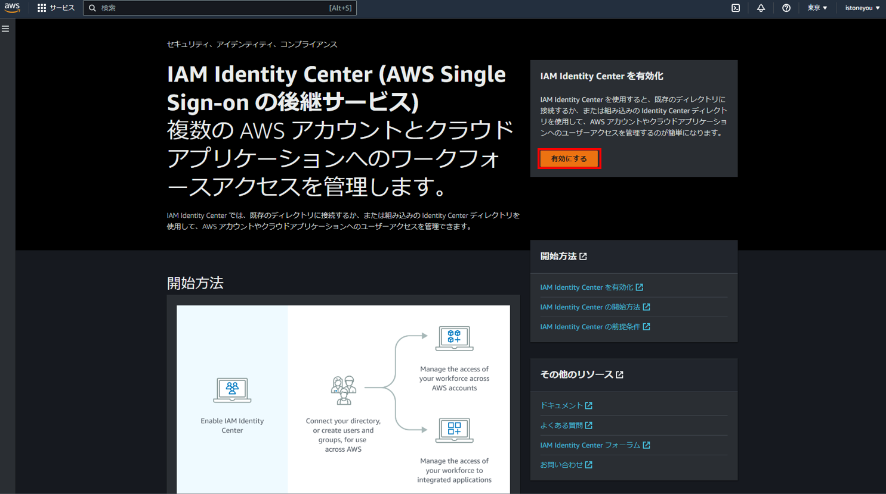
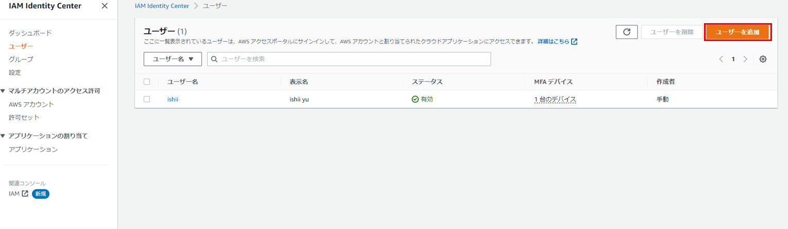
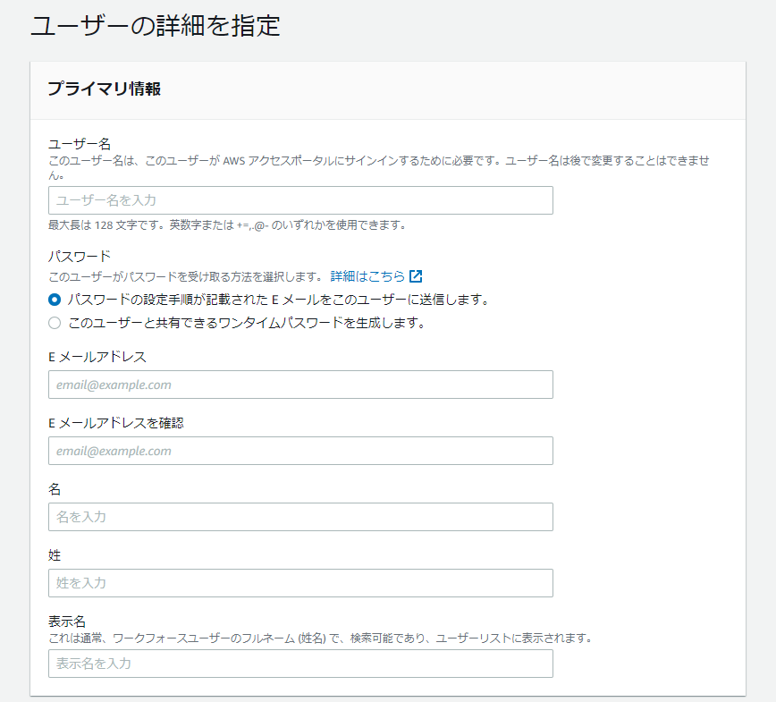
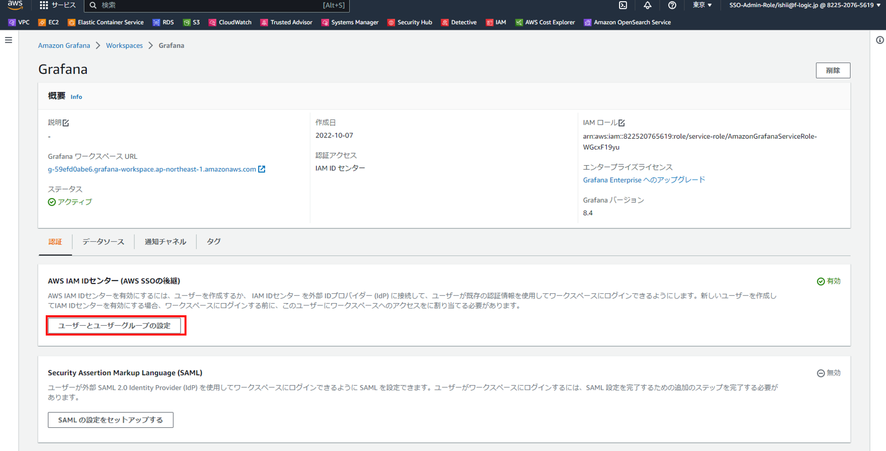
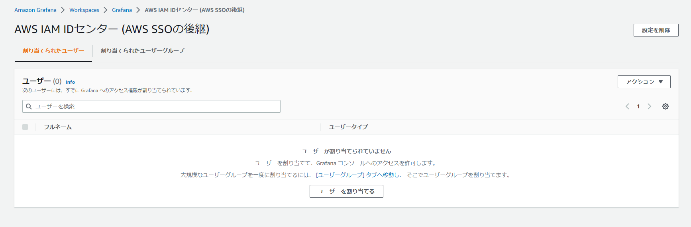

# IAM Identity Center
Amazon Managed Grafanaを使用するために、IAM Identity Centerの設定を行います。 
IAM Identity Centerを使用すると、複数のAWSアカウントやOpenSearchへのログインも行えます。   

AWSのマネジメントコンソールからIAM Identity Centerを開き、`有効にする`をクリックします。 

 

`ユーザーを追加`をクリックします。 

 

情報を入力してユーザーを作成してください。 

 

Amazon Managed Grafanaを利用するにはAmazon Managed Grafanaにて別途設定が必要です。マネジメントコンソールでワークスペースを開いて、`ユーザーとユーザーグループの設定`をクリックします。 

 

先ほど作成したユーザーを割り当ててください。もしくはグループを作成してグループを割り当ててください。 

 

